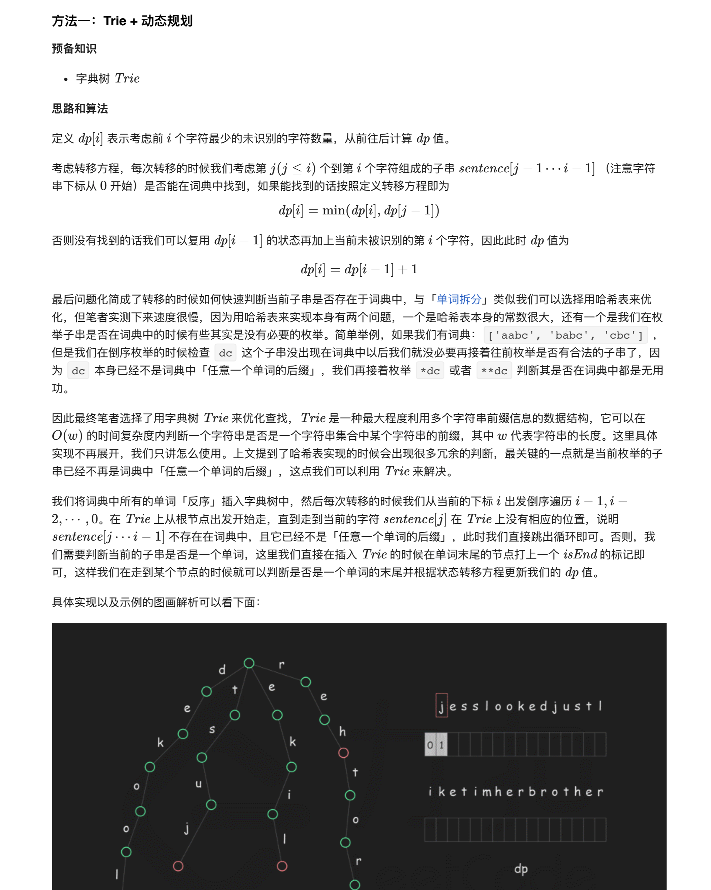
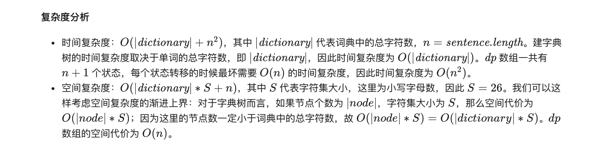
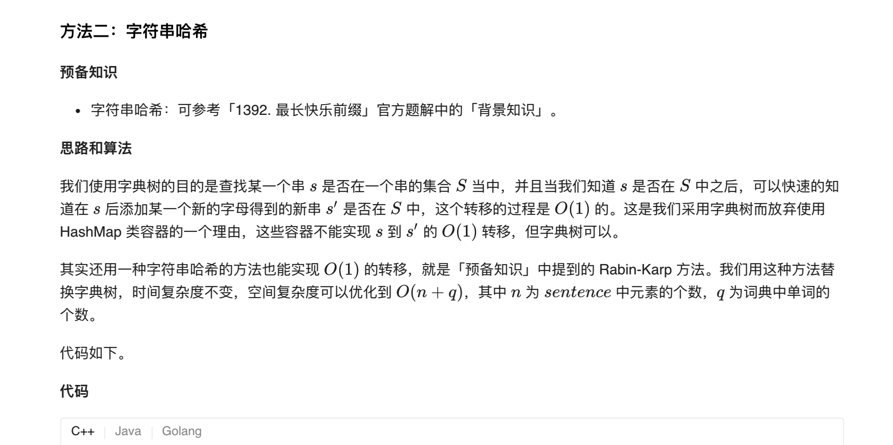

### 官方题解 [@link](https://leetcode-cn.com/problems/re-space-lcci/solution/hui-fu-kong-ge-by-leetcode-solution/)


```Golang
func respace(dictionary []string, sentence string) int {
    n, inf := len(sentence), 0x3f3f3f3f
    root := &Trie{next: [26]*Trie{}}
    for _, word := range dictionary {
        root.insert(word)
    }
    dp := make([]int, n + 1)
    for i := 1; i < len(dp); i++ {
        dp[i] = inf
    }
    for i := 1; i <= n; i++ {
        dp[i] = dp[i-1] + 1
        curPos := root
        for j := i; j >= 1; j-- {
            t := int(sentence[j-1] - 'a')
            if curPos.next[t] == nil {
                break
            } else if curPos.next[t].isEnd {
                dp[i] = min(dp[i], dp[j-1])
            }
            if dp[i] == 0 {
                break
            }
            curPos = curPos.next[t]
        }
    }
    return dp[n]
}

type Trie struct {
    next [26]*Trie
    isEnd bool
}

func (this *Trie) insert(s string) {
    curPos := this
    for i := len(s) - 1; i >= 0; i-- {
        t := int(s[i] - 'a')
        if curPos.next[t] == nil {
            curPos.next[t] = &Trie{next: [26]*Trie{}}
        }
        curPos = curPos.next[t]
    }
    curPos.isEnd = true
}

func min(x, y int) int {
    if x < y {
        return x
    }
    return y
}
```


```Golang
const (
    P = math.MaxInt32
    BASE = 41
)

func respace(dictionary []string, sentence string) int {
    hashValues := map[int]bool{}
    for _, word := range dictionary {
        hashValues[getHash(word)] = true
    }
    f := make([]int, len(sentence) + 1)
    for i := 1; i < len(f); i++ {
        f[i] = len(sentence)
    }
    for i := 1; i <= len(sentence); i++ {
        f[i] = f[i-1] + 1
        hashValue := 0
        for j := i; j >= 1; j-- {
            t := int(sentence[j-1] - 'a') + 1
            hashValue = (hashValue * BASE + t) % P
            if hashValues[hashValue] {
                f[i] = min(f[i], f[j-1])
            }
        }
    }
    return f[len(sentence)]
}

func getHash(s string) int {
    hashValue := 0
    for i := len(s) - 1; i >= 0; i-- {
        hashValue = (hashValue * BASE + int(s[i] - 'a') + 1) % P
    }
    return hashValue
}

func min(x, y int) int {
    if x < y {
        return x
    }
    return y
}
```
