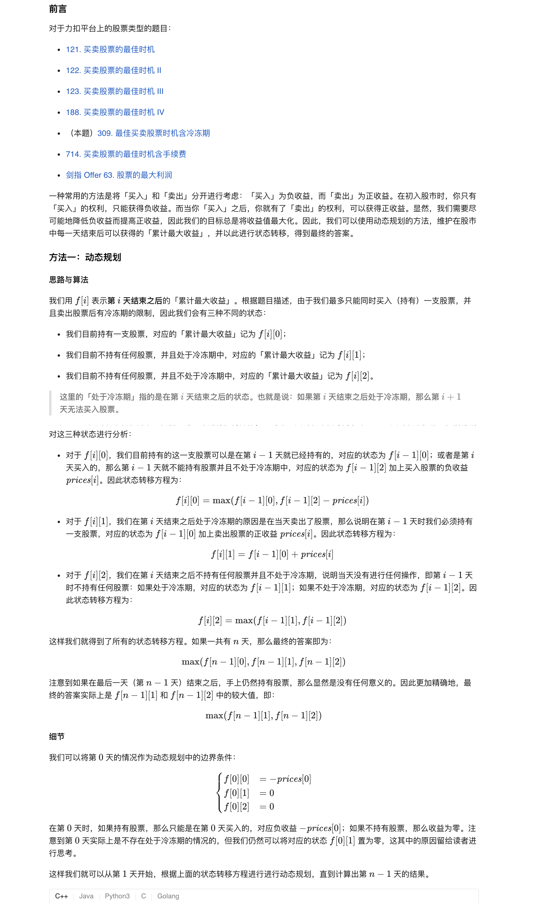
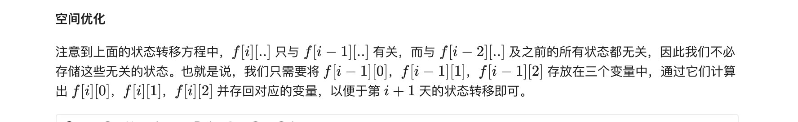
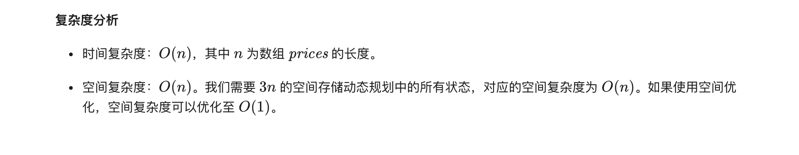

### 官方题解 [@link](https://leetcode-cn.com/problems/best-time-to-buy-and-sell-stock-with-cooldown/solution/zui-jia-mai-mai-gu-piao-shi-ji-han-leng-dong-qi-4/)


```Golang
func maxProfit(prices []int) int {
    if len(prices) == 0 {
        return 0
    }
    n := len(prices)
    // f[i][0]: 手上持有股票的最大收益
    // f[i][1]: 手上不持有股票，并且处于冷冻期中的累计最大收益
    // f[i][2]: 手上不持有股票，并且不在冷冻期中的累计最大收益
    f := make([][3]int, n)
    f[0][0] = -prices[0]
    for i := 1; i < n; i++ {
        f[i][0] = max(f[i-1][0], f[i-1][2] - prices[i])
        f[i][1] = f[i-1][0] + prices[i]
        f[i][2] = max(f[i-1][1], f[i-1][2]) 
    }
    return max(f[n-1][1], f[n-1][2])
}

func max(x, y int) int {
    if x > y {
        return x
    }
    return y
}
```

```
func maxProfit(prices []int) int {
    if len(prices) == 0 {
        return 0
    }
    n := len(prices)
    f0, f1, f2 := -prices[0], 0, 0
    for i := 1; i < n; i++ {
        newf0 := max(f0, f2 - prices[i])
        newf1 := f0 + prices[i]
        newf2 := max(f1, f2)
        f0, f1, f2 = newf0, newf1, newf2
    }
    return max(f1, f2)
}

func max(x, y int) int {
    if x > y {
        return x
    }
    return y
}
```
