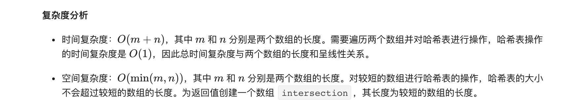

### 官方题解 [@link](https://leetcode-cn.com/problems/intersection-of-two-arrays-ii/solution/liang-ge-shu-zu-de-jiao-ji-ii-by-leetcode-solution/)


```Golang
func intersect(nums1 []int, nums2 []int) []int {
    if len(nums1) > len(nums2) {
        return intersect(nums2, nums1)
    }
    m := map[int]int{}
    for _, num := range nums1 {
        m[num]++
    }

    intersection := []int{}
    for _, num := range nums2 {
        if m[num] > 0 {
            intersection = append(intersection, num)
            m[num]--
        }
    }
    return intersection
}
```


```Golang
func intersect(nums1 []int, nums2 []int) []int {
    sort.Ints(nums1)
    sort.Ints(nums2)
    length1, length2 := len(nums1), len(nums2)
    index1, index2 := 0, 0

    intersection := []int{}
    for index1 < length1 && index2 < length2 {
        if nums1[index1] < nums2[index2] {
            index1++
        } else if nums1[index1] > nums2[index2] {
            index2++
        } else {
            intersection = append(intersection, nums1[index1])
            index1++
            index2++
        }
    }
    return intersection
}
```
