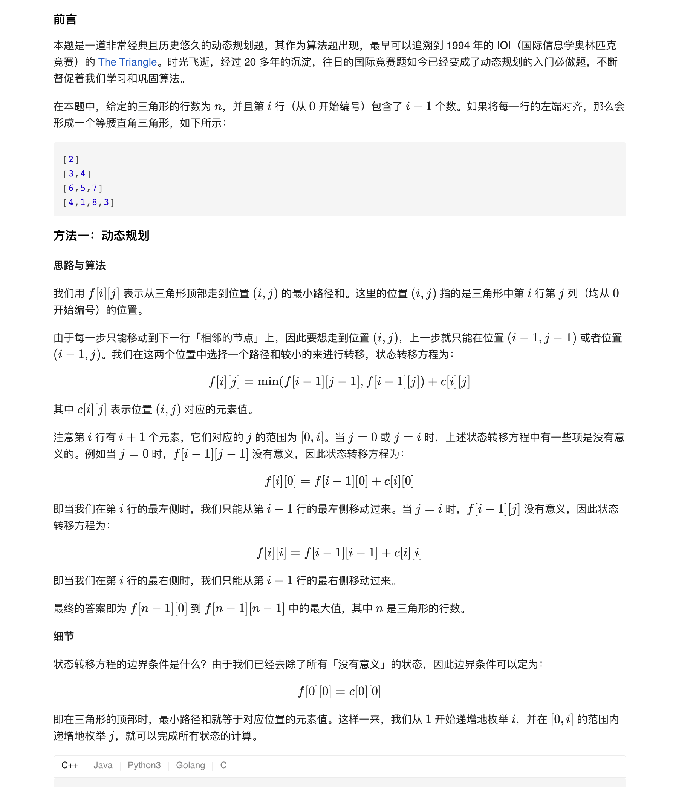
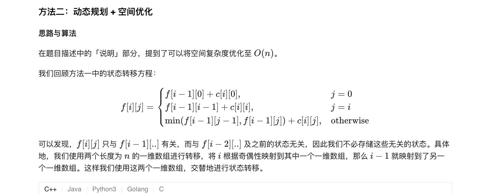
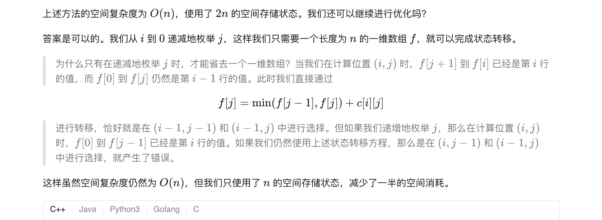
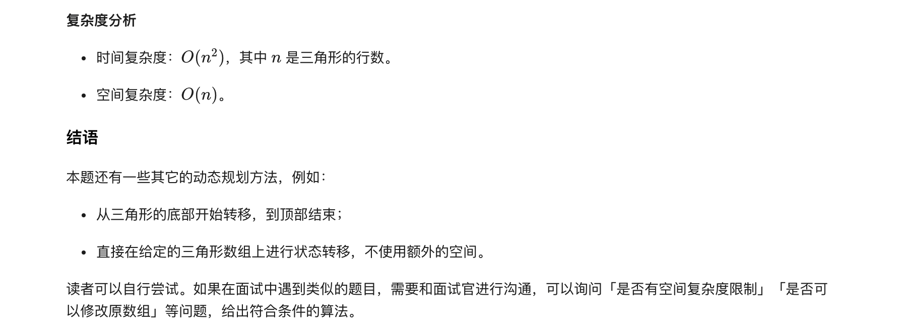

### 官方题解 [@link](https://leetcode-cn.com/problems/triangle/solution/san-jiao-xing-zui-xiao-lu-jing-he-by-leetcode-solu/)


```Golang
func minimumTotal(triangle [][]int) int {
    n := len(triangle)
    f := make([][]int, n)
    for i := 0; i < n; i++ {
        f[i] = make([]int, n)
    }
    f[0][0] = triangle[0][0]
    for i := 1; i < n; i++ {
        f[i][0] = f[i - 1][0] + triangle[i][0]
        for j := 1; j < i; j++ {
            f[i][j] = min(f[i - 1][j - 1], f[i - 1][j]) + triangle[i][j]
        }
        f[i][i] = f[i - 1][i - 1] + triangle[i][i]
    }
    ans := math.MaxInt32
    for i := 0; i < n; i++ {
        ans = min(ans, f[n-1][i])
    }
    return ans
}

func min(x, y int) int {
    if x < y {
        return x
    }
    return y
}
```


```
func minimumTotal(triangle [][]int) int {
    n := len(triangle)
    f := [2][]int{}
    for i := 0; i < 2; i++ {
        f[i] = make([]int, n)
    }
    f[0][0] = triangle[0][0]
    for i := 1; i < n; i++ {
        curr := i % 2
        prev := 1 - curr
        f[curr][0] = f[prev][0] + triangle[i][0]
        for j := 1; j < i; j++ {
            f[curr][j] = min(f[prev][j - 1], f[prev][j]) + triangle[i][j]
        }
        f[curr][i] = f[prev][i - 1] + triangle[i][i]
    }
    ans := math.MaxInt32
    for i := 0; i < n; i++ {
        ans = min(ans, f[(n-1)%2][i])
    }
    return ans
}

func min(x, y int) int {
    if x < y {
        return x
    }
    return y
}
```

```
func minimumTotal(triangle [][]int) int {
    n := len(triangle)
    f := make([]int, n)
    f[0] = triangle[0][0]
    for i := 1; i < n; i++ {
        f[i] = f[i - 1] + triangle[i][i]
        for j := i - 1; j > 0; j-- {
            f[j] = min(f[j - 1], f[j]) + triangle[i][j]
        }
        f[0] += triangle[i][0]
    }
    ans := math.MaxInt32
    for i := 0; i < n; i++ {
        ans = min(ans, f[i])
    }
    return ans
}

func min(x, y int) int {
    if x < y {
        return x
    }
    return y
}
```
