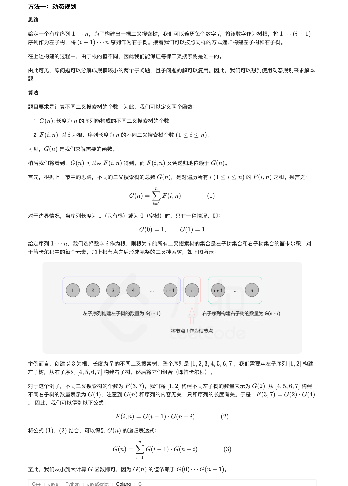
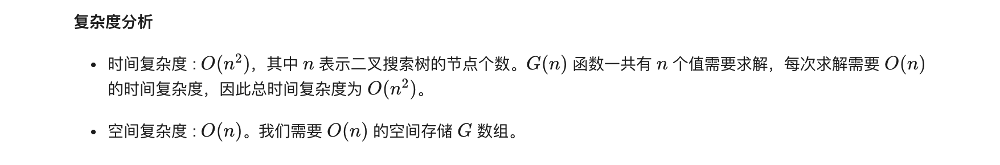

### 官方题解 [@link](https://leetcode-cn.com/problems/unique-binary-search-trees/solution/bu-tong-de-er-cha-sou-suo-shu-by-leetcode-solution/)


```Golang
func numTrees(n int) int {
    G := make([]int, n + 1)
    G[0], G[1] = 1, 1
    for i := 2; i <= n; i++ {
        for j := 1; j <= i; j++ {
            G[i] += G[j-1] * G[i-j]
        }
    }
    return G[n]
}
```


```
func numTrees(n int) int {
    C := 1
    for i := 0; i < n; i++ {
        C = C * 2 * (2 * i + 1) / (i + 2);
    }
    return C
}
```
