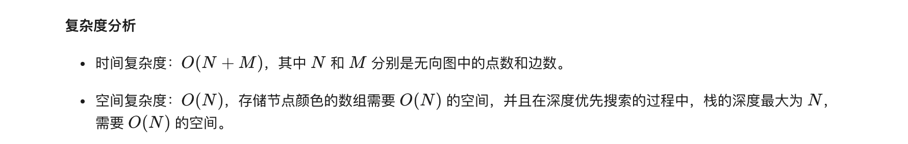

### 官方题解 [@link](https://leetcode-cn.com/problems/is-graph-bipartite/solution/pan-duan-er-fen-tu-by-leetcode-solution/)


```Golang
var (
    UNCOLORED, RED, GREEN = 0, 1, 2
    color []int
    valid bool
)

func isBipartite(graph [][]int) bool {
    n := len(graph)
    valid = true
    color = make([]int, n)
    for i := 0; i < n && valid; i++ {
        if color[i] == UNCOLORED {
            dfs(i, RED, graph)
        }
    }
    return valid
}

func dfs(node, c int, graph [][]int) {
    color[node] = c
    cNei := RED
    if c == RED {
        cNei = GREEN
    }
    for _, neighbor := range graph[node] {
        if color[neighbor] == UNCOLORED {
            dfs(neighbor, cNei, graph)
            if !valid {
                return 
            }
        } else if color[neighbor] != cNei {
            valid = false
            return
        }
    }
}
```


```
var (
    UNCOLORED, RED, GREEN = 0, 1, 2
)

func isBipartite(graph [][]int) bool {
    n := len(graph)
    color := make([]int, n)
    for i := 0; i < n; i++ {
        if color[i] == UNCOLORED {
            queue := []int{}
            queue = append(queue, i)
            color[i] = RED
            for i := 0; i < len(queue); i++ {
                node := queue[i]
                cNei := RED
                if color[node] == RED {
                    cNei = GREEN
                }
                for _, neighbor := range graph[node] {
                    if color[neighbor] == UNCOLORED {
                        queue = append(queue, neighbor)
                        color[neighbor] = cNei
                    } else if color[neighbor] != cNei {
                        return false
                    } 
                }
            }
        }
    }
    return true
}
```
