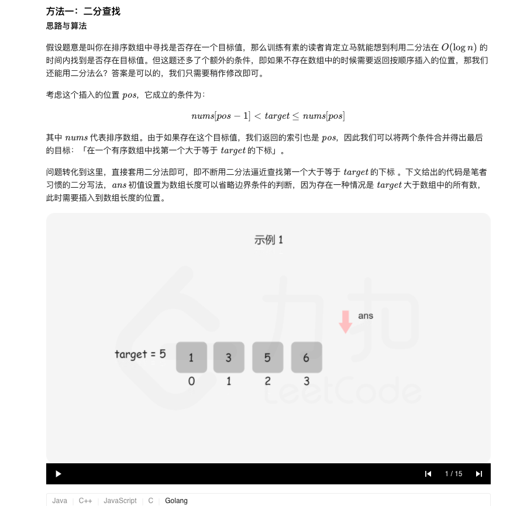

### 官方题解 [@link](https://leetcode-cn.com/problems/search-insert-position/solution/sou-suo-cha-ru-wei-zhi-by-leetcode-solution/)


```Golang
func searchInsert(nums []int, target int) int {
    n := len(nums)
    left, right := 0, n - 1
    ans := n
    for left <= right {
        mid := (right - left) >> 1 + left
        if target <= nums[mid] {
            ans = mid
            right = mid - 1
        } else {
            left = mid + 1
        }
    }
    return ans
}
```
