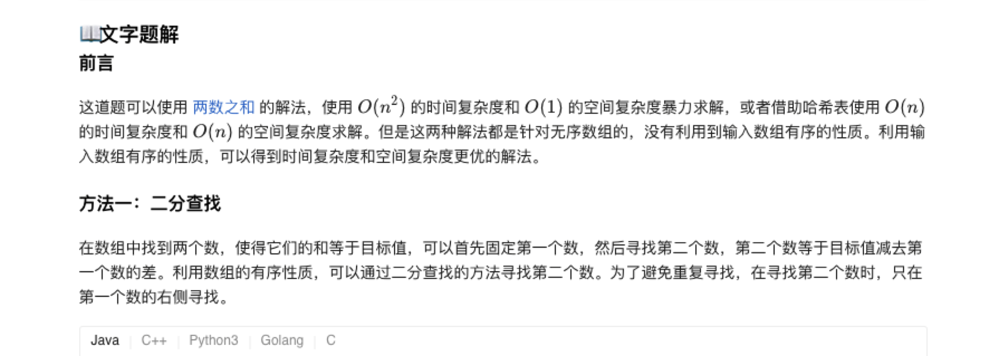

### 官方题解 [@link](https://leetcode-cn.com/problems/two-sum-ii-input-array-is-sorted/solution/liang-shu-zhi-he-ii-shu-ru-you-xu-shu-zu-by-leet-2/)


```Golang
func twoSum(numbers []int, target int) []int {
    for i := 0; i < len(numbers); i++ {
        low, high := i + 1, len(numbers) - 1
        for low <= high {
            mid := (high - low) / 2 + low
            if numbers[mid] == target - numbers[i] {
                return []int{i + 1, mid + 1}
            } else if numbers[mid] > target - numbers[i] {
                high = mid - 1
            } else {
                low = mid + 1
            }
        }
    }
    return []int{-1, -1}
}
```


```Golang
func twoSum(numbers []int, target int) []int {
    low, high := 0, len(numbers) - 1
    for low < high {
        sum := numbers[low] + numbers[high]
        if sum == target {
            return []int{low + 1, high + 1}
        } else if sum < target {
            low++
        } else {
            high--
        }
    }
    return []int{-1, -1}
}
```
