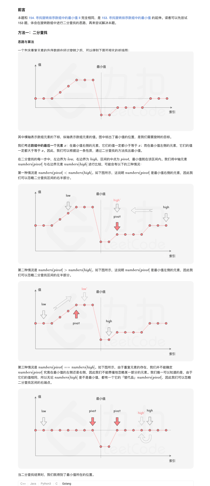
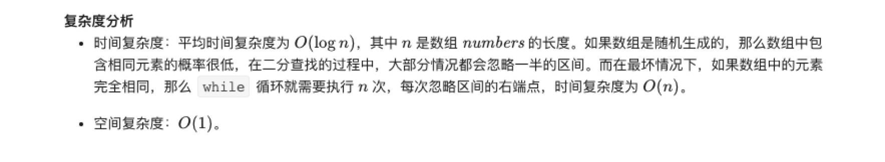

### 官方题解 [@link](https://leetcode-cn.com/problems/xuan-zhuan-shu-zu-de-zui-xiao-shu-zi-lcof/solution/xuan-zhuan-shu-zu-de-zui-xiao-shu-zi-by-leetcode-s/)


```Golang
func minArray(numbers []int) int {
	low := 0
	high := len(numbers) - 1
	for low < high {
		pivot := low + (high - low) / 2
        if numbers[pivot] < numbers[high] {
            high = pivot
        } else if numbers[pivot] > numbers[high] {
            low = pivot + 1
        } else {
            high--
        }
	}
	return numbers[low]
}
```

