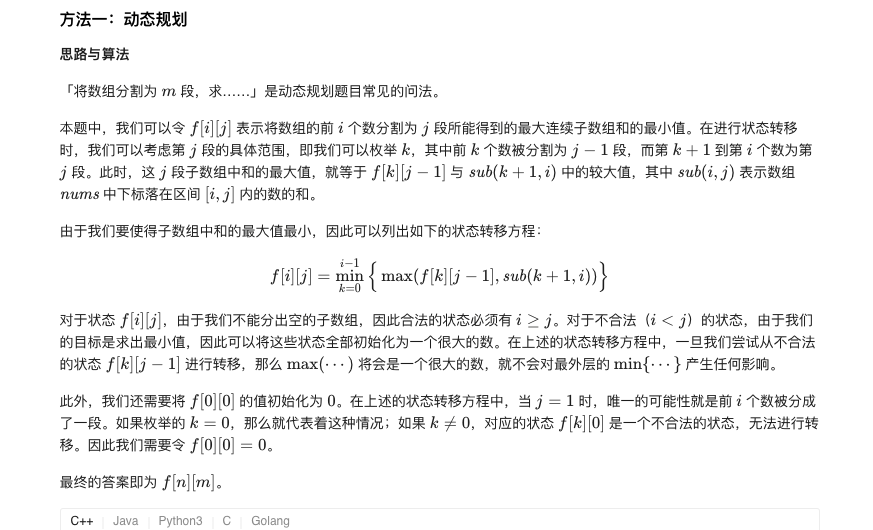
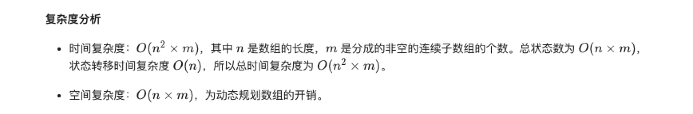
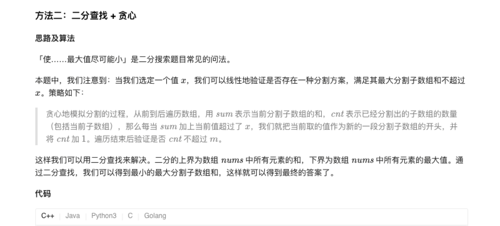
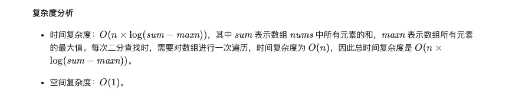

### 官方题解 [@link](https://leetcode-cn.com/problems/split-array-largest-sum/solution/fen-ge-shu-zu-de-zui-da-zhi-by-leetcode-solution/)


```Golang
func splitArray(nums []int, m int) int {
    n := len(nums)
    f := make([][]int, n + 1)
    sub := make([]int, n + 1)
    for i := 0; i < len(f); i++ {
        f[i] = make([]int, m + 1)
        for j := 0; j < len(f[i]); j++ {
            f[i][j] = math.MaxInt32
        }
    }
    for i := 0; i < n; i++ {
        sub[i + 1] = sub[i] + nums[i]
    }
    f[0][0] = 0
    for i := 1; i <= n; i++ {
        for j := 1; j <= min(i, m); j++ {
            for k := 0; k < i; k++ {
                f[i][j] = min(f[i][j], max(f[k][j - 1], sub[i] - sub[k]))
            }
        }
    }
    return f[n][m]
}

func min(x, y int) int {
    if x < y {
        return x
    }
    return y
}

func max(x, y int) int {
    if x > y {
        return x
    }
    return y
}
```


```Golang
func splitArray(nums []int, m int) int {
    left, right := 0, 0
    for i := 0; i < len(nums); i++ {
        right += nums[i]
        if left < nums[i] {
            left = nums[i]
        }
    }
    for left < right {
        mid := (right - left) / 2 + left
        if check(nums, mid, m) {
            right = mid
        } else {
            left = mid + 1
        }
    }
    return left
}

func check(nums []int, x, m int) bool {
    sum, cnt := 0, 1
    for i := 0; i < len(nums); i++ {
        if sum + nums[i] > x {
            cnt++
            sum = nums[i]
        } else {
            sum += nums[i]
        }
    }
    return cnt <= m
}
```

