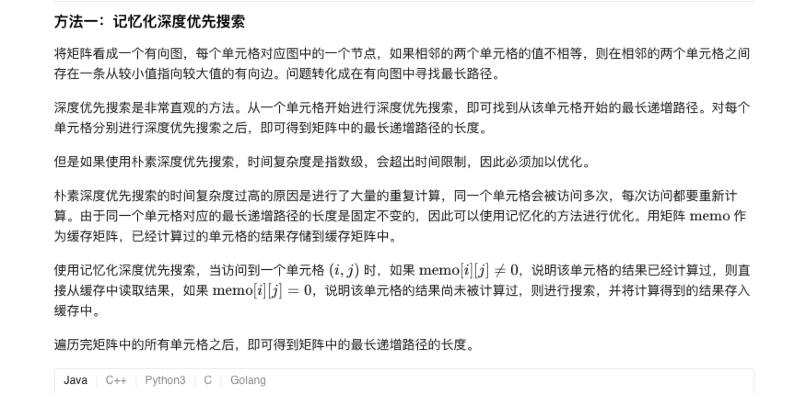
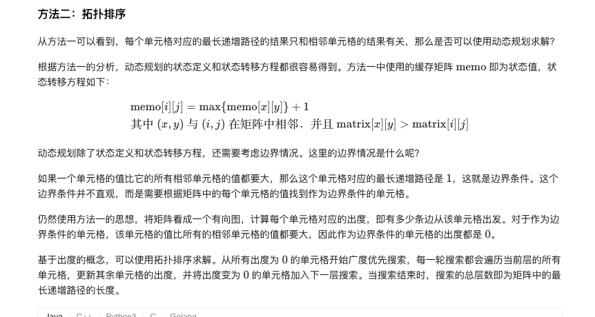
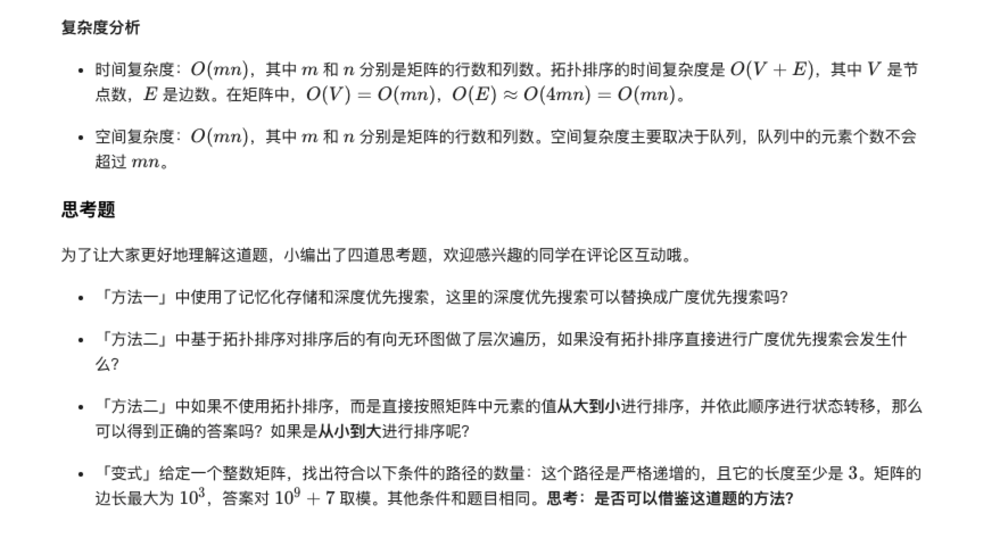

### 官方题解 [@link](https://leetcode-cn.com/problems/longest-increasing-path-in-a-matrix/solution/ju-zhen-zhong-de-zui-chang-di-zeng-lu-jing-by-le-2/)


```Golang
var (
    dirs = [][]int{[]int{-1, 0}, []int{1, 0}, []int{0, -1}, []int{0, 1}}
    rows, columns int
)

func longestIncreasingPath(matrix [][]int) int {
    if len(matrix) == 0 || len(matrix[0]) == 0 {
        return 0
    }
    rows, columns = len(matrix), len(matrix[0])
    memo := make([][]int, rows)
    for i := 0; i < rows; i++ {
        memo[i] = make([]int, columns)
    }
    ans := 0
    for i := 0; i < rows; i++ {
        for j := 0; j < columns; j++ {
            ans = max(ans, dfs(matrix, i, j, memo))
        }
    }
    return ans
}

func dfs(matrix [][]int, row, column int, memo [][]int) int {
    if memo[row][column] != 0 {
        return memo[row][column]
    }
    memo[row][column]++
    for _, dir := range dirs {
        newRow, newColumn := row + dir[0], column + dir[1]
        if newRow >= 0 && newRow < rows && newColumn >= 0 && newColumn < columns && matrix[newRow][newColumn] > matrix[row][column] {
            memo[row][column] = max(memo[row][column], dfs(matrix, newRow, newColumn, memo) + 1)
        }
    }
    return memo[row][column]
}

func max(x, y int) int {
    if x > y {
        return x
    }
    return y
}
```


```Golang
var (
    dirs = [][]int{[]int{-1, 0}, []int{1, 0}, []int{0, -1}, []int{0, 1}}
    rows, columns int
)

func longestIncreasingPath(matrix [][]int) int {
    if len(matrix) == 0 || len(matrix[0]) == 0 {
        return 0
    }
    rows, columns = len(matrix), len(matrix[0])
    outdegrees := make([][]int, rows)
    for i := 0; i < rows; i++ {
        outdegrees[i] = make([]int, columns)
    }
    for i := 0; i < rows; i++ {
        for j := 0; j < columns; j++ {
            for _, dir := range dirs {
                newRow, newColumn := i + dir[0], j + dir[1]
                if newRow >= 0 && newRow < rows && newColumn >= 0 && newColumn < columns && matrix[newRow][newColumn] > matrix[i][j] {
                    outdegrees[i][j]++
                }
            }
        }
    }

    queue := [][]int{}
    for i := 0; i < rows; i++ {
        for j := 0; j < columns; j++ {
            if outdegrees[i][j] == 0 {
                queue = append(queue, []int{i, j})
            }
        }
    }
    ans := 0
    for len(queue) != 0 {
        ans++
        size := len(queue)
        for i := 0; i < size; i++ {
            cell := queue[0]
            queue = queue[1:]
            row, column := cell[0], cell[1]
            for _, dir := range dirs {
                newRow, newColumn := row + dir[0], column + dir[1]
                if newRow >= 0 && newRow < rows && newColumn >= 0 && newColumn < columns && matrix[newRow][newColumn] < matrix[row][column] {
                    outdegrees[newRow][newColumn]--
                    if outdegrees[newRow][newColumn] == 0 {
                        queue = append(queue, []int{newRow, newColumn})
                    }
                }
            }
        }
    }
    return ans
}
```

