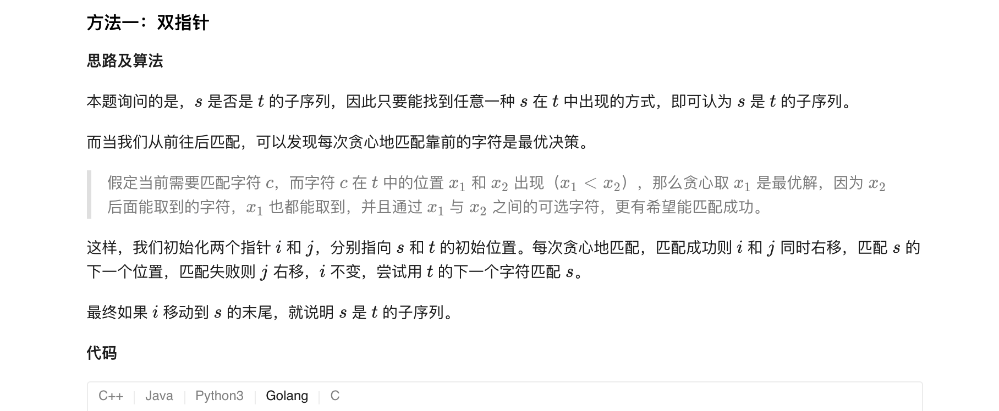
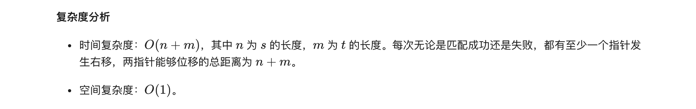
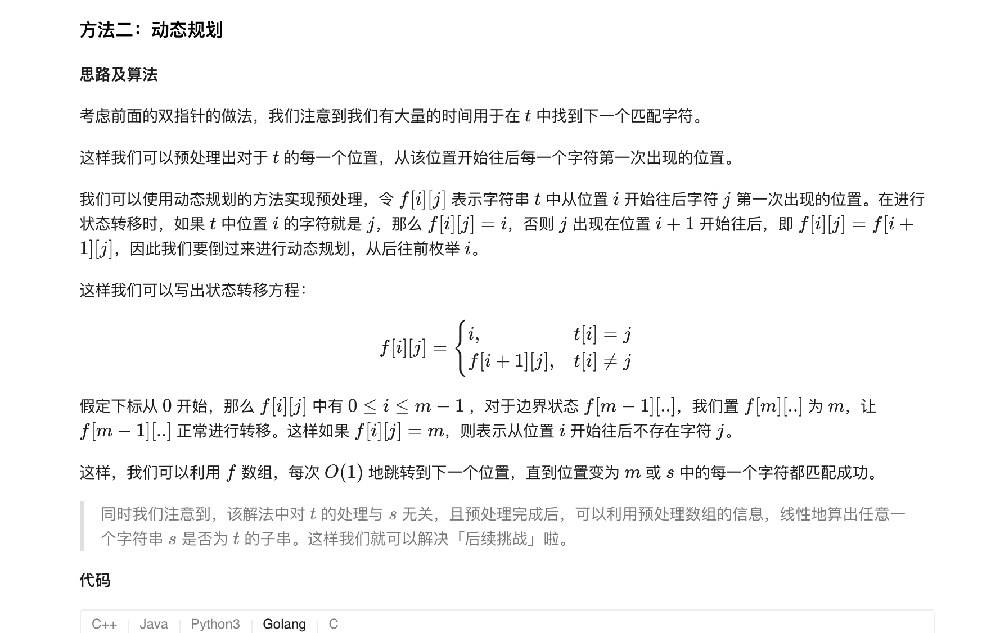
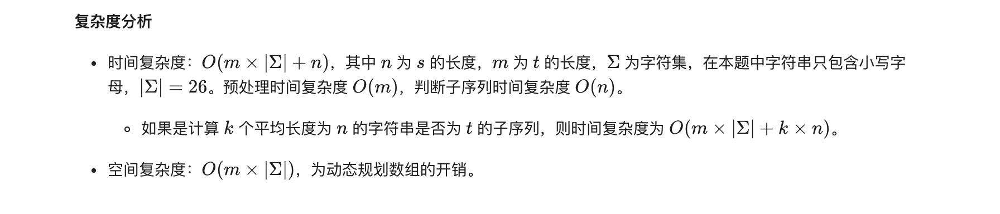

### 官方题解 [@link](https://leetcode-cn.com/problems/is-subsequence/solution/pan-duan-zi-xu-lie-by-leetcode-solution/)


```Golang
func isSubsequence(s string, t string) bool {
    n, m := len(s), len(t)
    i, j := 0, 0
    for i < n && j < m {
        if s[i] == t[j] {
            i++
        }
        j++
    }
    return i == n
}
```


```Golang
func isSubsequence(s string, t string) bool {
    n, m := len(s), len(t)
    f := make([][26]int, m + 1)
    for i := 0; i < 26; i++ {
        f[m][i] = m
    }
    for i := m - 1; i >= 0; i-- {
        for j := 0; j < 26; j++ {
            if t[i] == byte(j + 'a') {
                f[i][j] = i
            } else {
                f[i][j] = f[i + 1][j]
            }
        }
    }
    add := 0
    for i := 0; i < n; i++ {
        if f[add][int(s[i] - 'a')] == m {
            return false
        }
        add = f[add][int(s[i] - 'a')] + 1
    }
    return true
}
```

