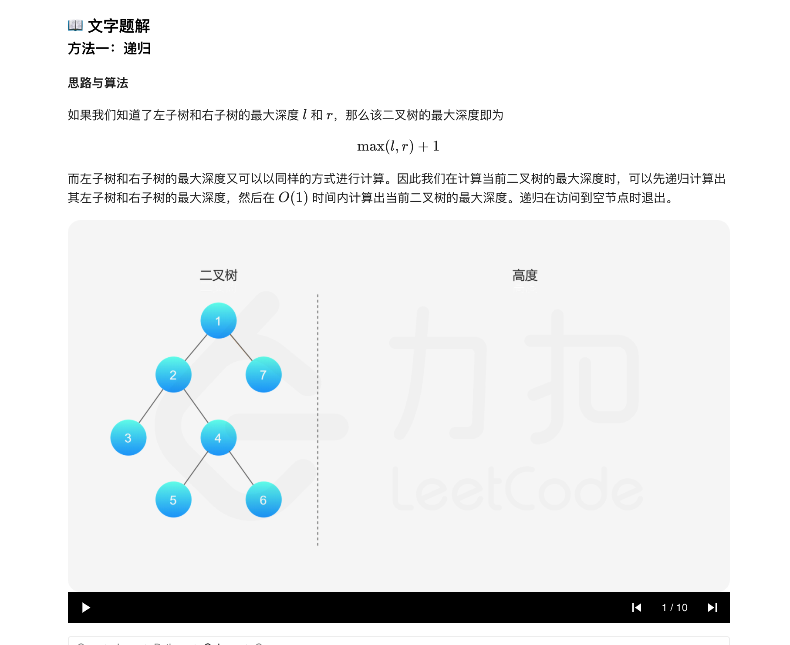
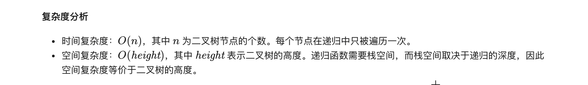
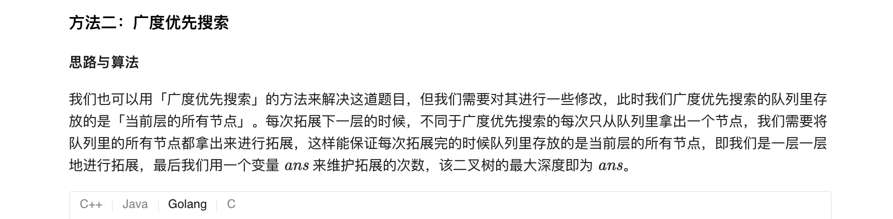
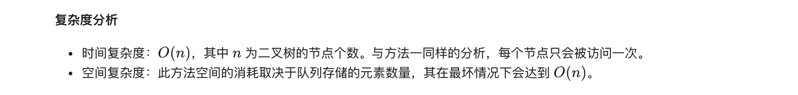

### 官方题解 [@link](https://leetcode-cn.com/problems/maximum-depth-of-binary-tree/solution/er-cha-shu-de-zui-da-shen-du-by-leetcode-solution/)


```Golang
func maxDepth(root *TreeNode) int {
    if root == nil {
        return 0
    }
    return max(maxDepth(root.Left), maxDepth(root.Right)) + 1
}

func max(a, b int) int {
    if a > b {
        return a
    }
    return b
}
```


```Golang
func maxDepth(root *TreeNode) int {
    if root == nil {
        return 0
    }
    queue := []*TreeNode{}
    queue = append(queue, root)
    ans := 0
    for len(queue) > 0 {
        sz := len(queue)
        for sz > 0 {
            node := queue[0]
            queue = queue[1:]
            if node.Left != nil {
                queue = append(queue, node.Left)
            }
            if node.Right != nil {
                queue = append(queue, node.Right)
            }
            sz--
        }
        ans++
    }
    return ans
}
```

