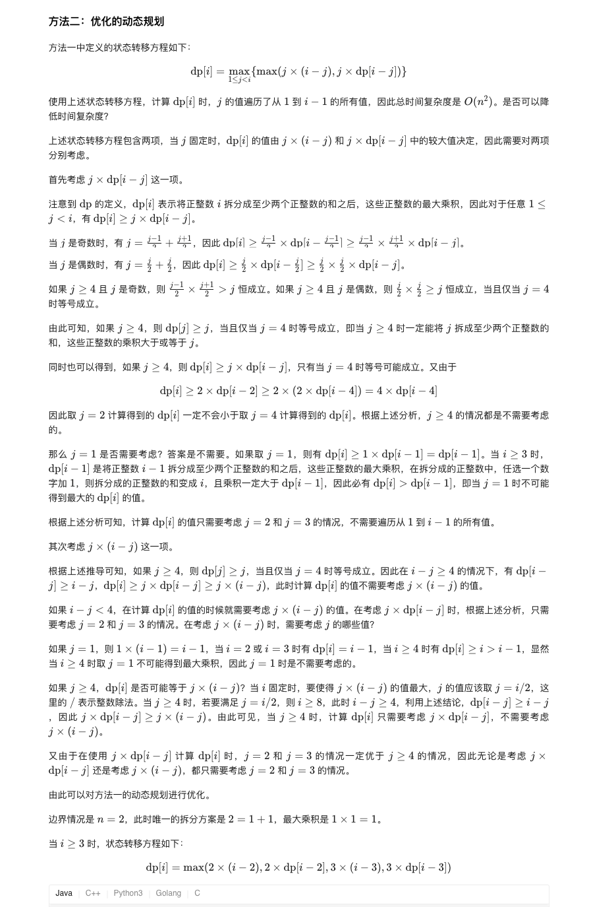
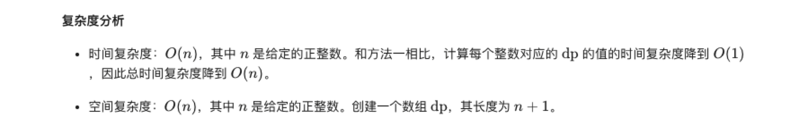

### 官方题解 [@link](https://leetcode-cn.com/problems/integer-break/solution/zheng-shu-chai-fen-by-leetcode-solution/)


```Golang
func integerBreak(n int) int {
    dp := make([]int, n + 1)
    for i := 2; i <= n; i++ {
        curMax := 0
        for j := 1; j < i; j++ {
            curMax = max(curMax, max(j * (i - j), j * dp[i - j]))
        }
        dp[i] = curMax
    }
    return dp[n]
}

func max(x, y int) int {
    if x > y {
        return x
    }
    return y
}
```


 ```Golang
func integerBreak(n int) int {
    if n < 4 {
        return n - 1
    }
    dp := make([]int, n + 1)
    dp[2] = 1
    for i := 3; i <= n; i++ {
        dp[i] = max(max(2 * (i - 2), 2 * dp[i - 2]), max(3 * (i - 3), 3 * dp[i - 3]))
    }
    return dp[n]
}

func max(x, y int) int {
    if x > y {
        return x
    }
    return y
}
 ```
 
 
 ```Golang
func integerBreak(n int) int {
    if n <= 3 {
        return n - 1
    }
    quotient := n / 3
    remainder := n % 3
    if remainder == 0 {
        return int(math.Pow(3, float64(quotient)))
    } else if remainder == 1 {
        return int(math.Pow(3, float64(quotient - 1))) * 4
    }
    return int(math.Pow(3, float64(quotient))) * 2
}
 ```
 