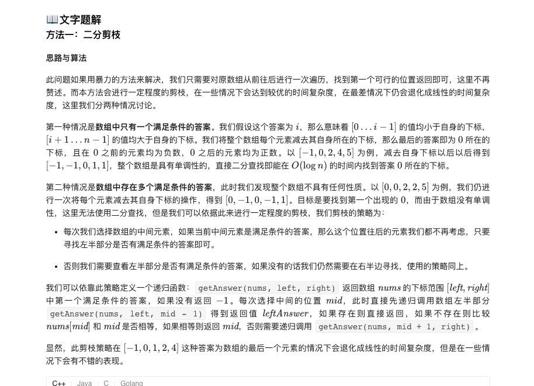
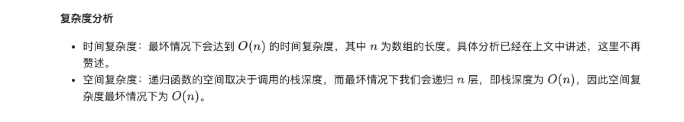

### 官方题解 [@link](https://leetcode-cn.com/problems/magic-index-lcci/solution/mo-zhu-suo-yin-by-leetcode-solution/)


```Golang
func findMagicIndex(nums []int) int {
    return getAnswer(nums, 0, len(nums) - 1)
}

func getAnswer(nums []int, left, right int) int {
    if left > right {
        return -1
    }
    mid := (right - left) / 2 + left
    leftAnswer := getAnswer(nums, left, mid - 1)
    if leftAnswer != -1 {
        return leftAnswer
    } else if nums[mid] == mid {
        return mid
    }
    return getAnswer(nums, mid + 1, right)
}
```
