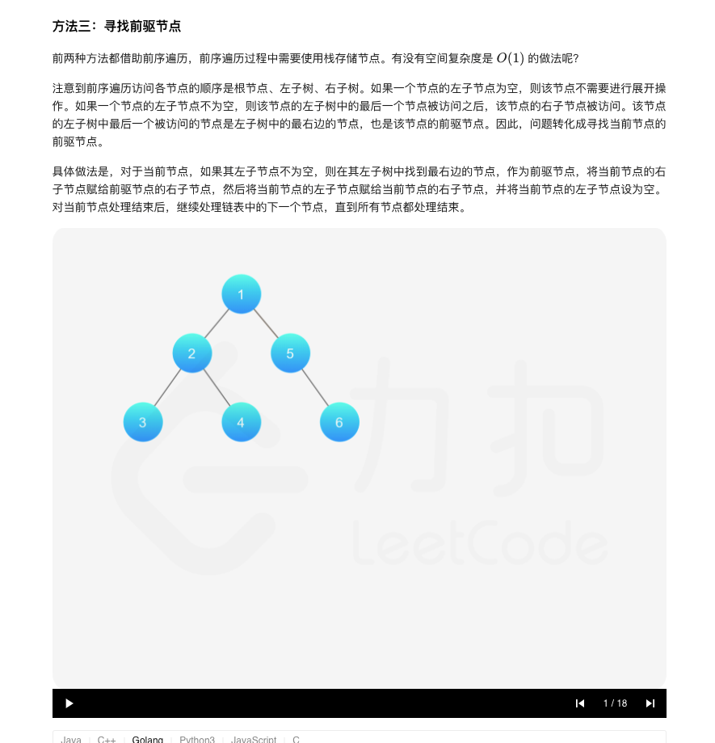

### 官方题解 [@link](https://leetcode-cn.com/problems/flatten-binary-tree-to-linked-list/solution/er-cha-shu-zhan-kai-wei-lian-biao-by-leetcode-solu/)


```Golang
func flatten(root *TreeNode)  {
    list := preorderTraversal(root)
    for i := 1; i < len(list); i++ {
        prev, curr := list[i-1], list[i]
        prev.Left, prev.Right = nil, curr
    }
}

func preorderTraversal(root *TreeNode) []*TreeNode {
    list := []*TreeNode{}
    if root != nil {
        list = append(list, root)
        list = append(list, preorderTraversal(root.Left)...)
        list = append(list, preorderTraversal(root.Right)...)
    }
    return list
}
```
以下代码通过迭代实现前序遍历。
```
func flatten(root *TreeNode)  {
    list := []*TreeNode{}
    stack := []*TreeNode{}
    node := root
    for node != nil || len(stack) > 0 {
        for node != nil {
            list = append(list, node)
            stack = append(stack, node)
            node = node.Left
        }
        node = stack[len(stack)-1]
        node = node.Right
        stack = stack[:len(stack)-1]
    }

    for i := 1; i < len(list); i++ {
        prev, curr := list[i-1], list[i]
        prev.Left, prev.Right = nil, curr
    }
}
```


```Golang
func flatten(root *TreeNode)  {
     if root == nil {
         return
     }
     stack := []*TreeNode{root}
     var prev *TreeNode
     for len(stack) > 0 {
         curr := stack[len(stack)-1]
         stack = stack[:len(stack)-1]
         if prev != nil {
             prev.Left, prev.Right = nil, curr
         }
         left, right := curr.Left, curr.Right
         if right != nil {
             stack = append(stack, right)
         }
         if left != nil {
             stack = append(stack, left)
         }
         prev = curr
     }
 }
```


```Golang
func flatten(root *TreeNode)  {
    curr := root
    for curr != nil {
        if curr.Left != nil {
            next := curr.Left
            predecessor := next
            for predecessor.Right != nil {
                predecessor = predecessor.Right
            }
            predecessor.Right = curr.Right
            curr.Left, curr.Right = nil, next
        }
        curr = curr.Right
    }
}
```
