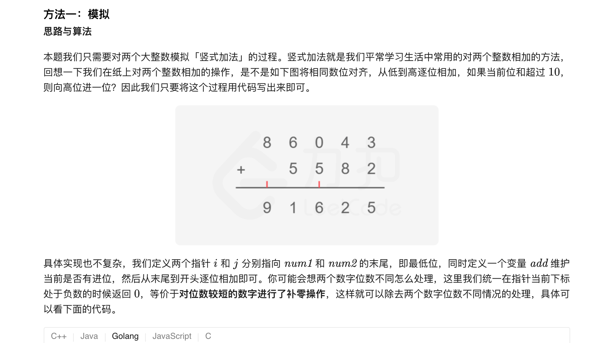

### 官方题解 [@link](https://leetcode-cn.com/problems/add-strings/solution/zi-fu-chuan-xiang-jia-by-leetcode-solution/)


```Golang
func addStrings(num1 string, num2 string) string {
    add := 0
    ans := ""
    for i, j := len(num1) - 1, len(num2) - 1; i >= 0 || j >= 0 || add != 0; i, j = i - 1, j - 1 {
        var x, y int
        if i >= 0 {
            x = int(num1[i] - '0')
        }
        if j >= 0 {
            y = int(num2[j] - '0')
        }
        result := x + y + add
        ans = strconv.Itoa(result%10) + ans
        add = result / 10
    }
    return ans
}
```
