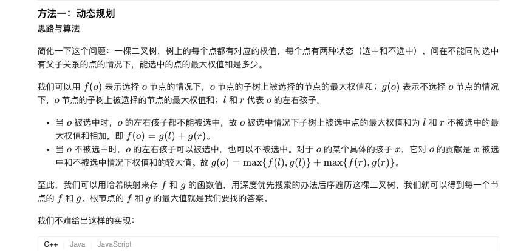
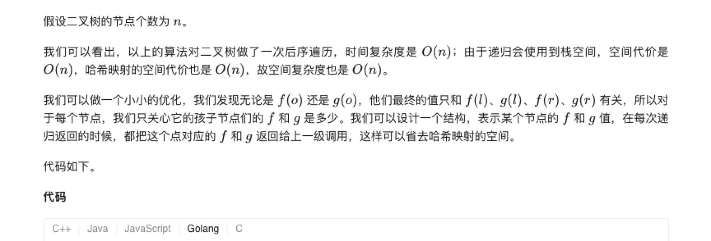
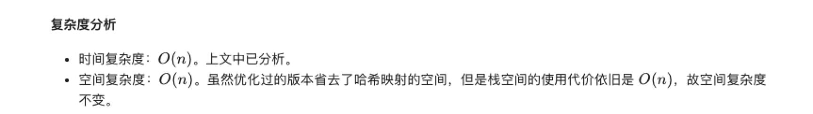

### 官方题解 [@link](https://leetcode-cn.com/problems/house-robber-iii/solution/da-jia-jie-she-iii-by-leetcode-solution/)


```Golang
class Solution {
public:
    unordered_map <TreeNode*, int> f, g;

    void dfs(TreeNode* o) {
        if (!o) {
            return;
        }
        dfs(o->left);
        dfs(o->right);
        f[o] = o->val + g[o->left] + g[o->right];
        g[o] = max(f[o->left], g[o->left]) + max(f[o->right], g[o->right]);
    }

    int rob(TreeNode* o) {
        dfs(o);
        return max(f[o], g[o]);
    }
};
```

```Golang
func rob(root *TreeNode) int {
    val := dfs(root)
    return max(val[0], val[1])
}

func dfs(node *TreeNode) []int {
    if node == nil {
        return []int{0, 0}
    }
    l, r := dfs(node.Left), dfs(node.Right)
    selected := node.Val + l[1] + r[1]
    notSelected := max(l[0], l[1]) + max(r[0], r[1])
    return []int{selected, notSelected}
}

func max(x, y int) int {
    if x > y {
        return x
    }
    return y
}
```
