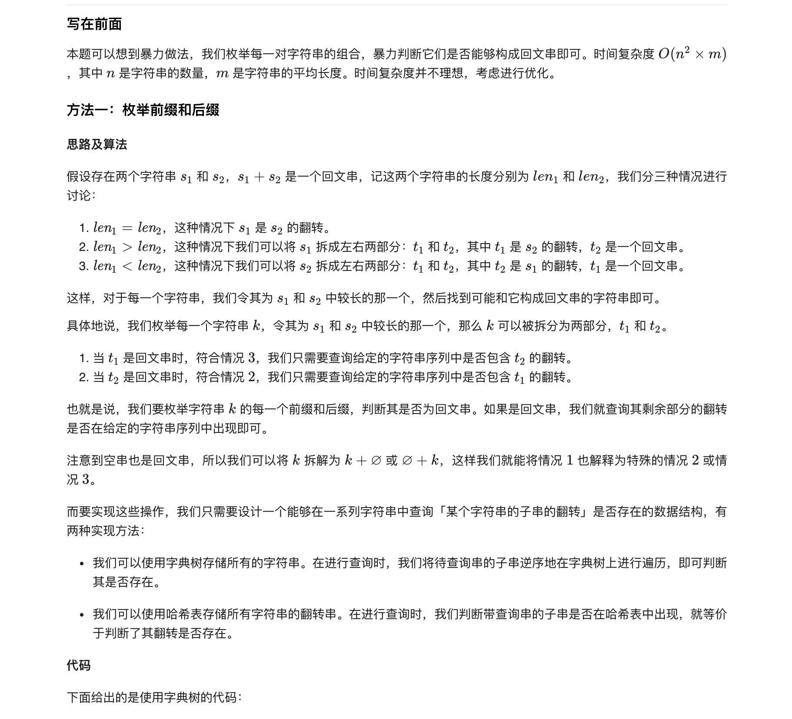
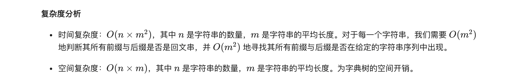
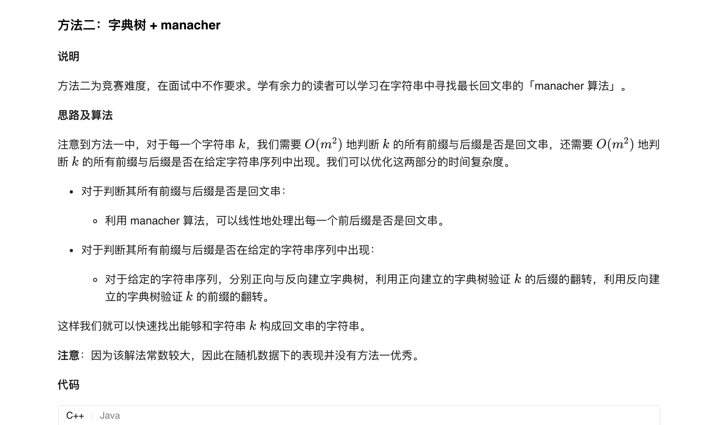
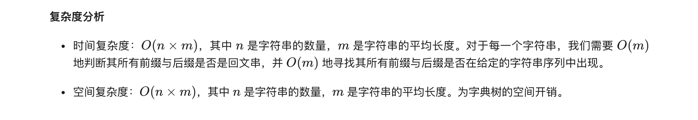

### 官方题解 [@link](https://leetcode-cn.com/problems/palindrome-pairs/solution/hui-wen-dui-by-leetcode-solution/)


```Golang
type Node struct {
    ch [26]int
    flag int
}

var tree []Node

func palindromePairs(words []string) [][]int {
    tree = []Node{Node{[26]int{}, -1}}
    n := len(words)
    for i := 0; i < n; i++ {
        insert(words[i], i)
    }
    ret := [][]int{}
    for i := 0; i < n; i++ {
        word := words[i]
        m := len(word)
        for j := 0; j <= m; j++ {
            if isPalindrome(word, j, m - 1) {
                leftId := findWord(word, 0, j - 1)
                if leftId != -1 && leftId != i {
                    ret = append(ret, []int{i, leftId})
                }
            }
            if j != 0 && isPalindrome(word, 0, j - 1) {
                rightId := findWord(word, j, m - 1)
                if rightId != -1 && rightId != i {
                    ret = append(ret, []int{rightId, i})
                }
            }
        }
    }
    return ret
}

func insert(s string, id int) {
    add := 0
    for i := 0; i < len(s); i++ {
        x := int(s[i] - 'a')
        if tree[add].ch[x] == 0 {
            tree = append(tree, Node{[26]int{}, -1})
            tree[add].ch[x] = len(tree) - 1
        }
        add = tree[add].ch[x]
    }
    tree[add].flag = id
}

func findWord(s string, left, right int) int {
    add := 0
    for i := right; i >= left; i-- {
        x := int(s[i] - 'a')
        if tree[add].ch[x] == 0 {
            return -1
        }
        add = tree[add].ch[x]
    }
    return tree[add].flag
}

func isPalindrome(s string, left, right int) bool {
    for i := 0; i < (right - left + 1) / 2; i++ {
        if s[left + i] != s[right - i] {
            return false
        }
    }
    return true
}
```
下面给出的是使用哈希表的代码：
```golang
func palindromePairs(words []string) [][]int {
    wordsRev := []string{}
    indices := map[string]int{}

    n := len(words)
    for _, word := range words {
        wordsRev = append(wordsRev, reverse(word))
    }
    for i := 0; i < n; i++ {
        indices[wordsRev[i]] = i
    }

    ret := [][]int{}
    for i := 0; i < n; i++ {
        word := words[i]
        m := len(word)
        if m == 0 {
            continue
        }
        for j := 0; j <= m; j++ {
            if isPalindrome(word, j, m - 1) {
                leftId := findWord(word, 0, j - 1, indices)
                if leftId != -1 && leftId != i {
                    ret = append(ret, []int{i, leftId})
                }
            }
            if j != 0 && isPalindrome(word, 0, j - 1) {
                rightId := findWord(word, j, m - 1, indices)
                if rightId != -1 && rightId != i {
                    ret = append(ret, []int{rightId, i})
                }
            }
        }
    }
    return ret
}

func findWord(s string, left, right int, indices map[string]int) int {
    if v, ok := indices[s[left:right+1]]; ok {
        return v
    }
    return -1
}

func isPalindrome(s string, left, right int) bool {
    for i := 0; i < (right - left + 1) / 2; i++ {
        if s[left + i] != s[right - i] {
            return false
        }
    }
    return true
}

func reverse(s string) string {
    n := len(s)
    b := []byte(s)
    for i := 0; i < n/2; i++ {
        b[i], b[n-i-1] = b[n-i-1], b[i]
    }
    return string(b)
}
```


```golang
struct Trie {
    struct node {
        int ch[26];
        int flag;
        node() {
            flag = -1;
            memset(ch, 0, sizeof(ch));
        }
    };

    vector<node> tree;

    Trie() { tree.emplace_back(); }

    void insert(string& s, int id) {
        int len = s.length(), add = 0;
        for (int i = 0; i < len; i++) {
            int x = s[i] - 'a';
            if (!tree[add].ch[x]) {
                tree.emplace_back();
                tree[add].ch[x] = tree.size() - 1;
            }
            add = tree[add].ch[x];
        }
        tree[add].flag = id;
    }

    vector<int> query(string& s) {
        int len = s.length(), add = 0;
        vector<int> ret(len + 1, -1);
        for (int i = 0; i < len; i++) {
            ret[i] = tree[add].flag;
            int x = s[i] - 'a';
            if (!tree[add].ch[x]) {
                return ret;
            }
            add = tree[add].ch[x];
        }
        ret[len] = tree[add].flag;
        return ret;
    }
};

class Solution {
public:
    vector<pair<int, int>> manacher(string& s) {
        int n = s.length();
        string tmp = "#";
        tmp += s[0];
        for (int i = 1; i < n; i++) {
            tmp += '*';
            tmp += s[i];
        }
        tmp += '!';
        int m = n * 2;
        vector<int> len(m);
        vector<pair<int, int>> ret(n);
        int p = 0, maxn = -1;
        for (int i = 1; i < m; i++) {
            len[i] = maxn >= i ? min(len[2 * p - i], maxn - i) : 0;
            while (tmp[i - len[i] - 1] == tmp[i + len[i] + 1]) {
                len[i]++;
            }
            if (i + len[i] > maxn) {
                p = i, maxn = i + len[i];
            }
            if (i - len[i] == 1) {
                ret[(i + len[i]) / 2].first = 1;
            }
            if (i + len[i] == m - 1) {
                ret[(i - len[i]) / 2].second = 1;
            }
        }
        return ret;
    }

    vector<vector<int>> palindromePairs(vector<string>& words) {
        Trie trie1, trie2;

        int n = words.size();
        for (int i = 0; i < n; i++) {
            trie1.insert(words[i], i);
            string tmp = words[i];
            reverse(tmp.begin(), tmp.end());
            trie2.insert(tmp, i);
        }

        vector<vector<int>> ret;
        for (int i = 0; i < n; i++) {
            const vector<pair<int, int>>& rec = manacher(words[i]);

            const vector<int>& id1 = trie2.query(words[i]);
            reverse(words[i].begin(), words[i].end());
            const vector<int>& id2 = trie1.query(words[i]);

            int m = words[i].size();

            int all_id = id1[m];
            if (all_id != -1 && all_id != i) {
                ret.push_back({i, all_id});
            }
            for (int j = 0; j < m; j++) {
                if (rec[j].first) {
                    int left_id = id2[m - j - 1];
                    if (left_id != -1 && left_id != i) {
                        ret.push_back({left_id, i});
                    }
                }
                if (rec[j].second) {
                    int right_id = id1[j];
                    if (right_id != -1 && right_id != i) {
                        ret.push_back({i, right_id});
                    }
                }
            }
        }
        return ret;
    }
};
```
