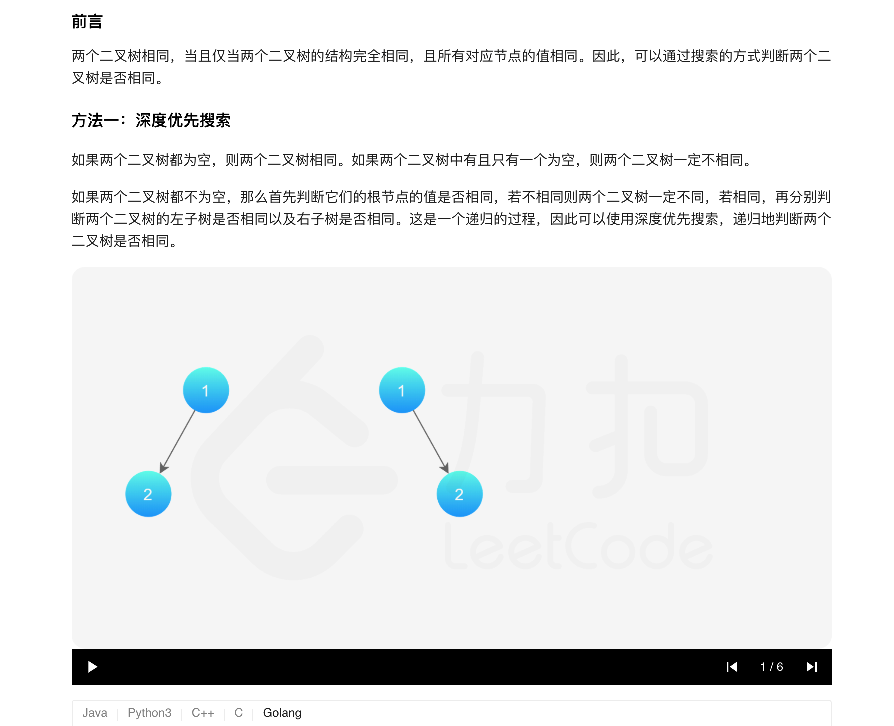
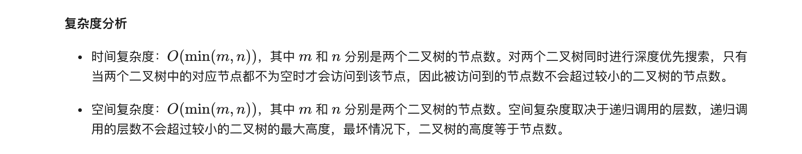
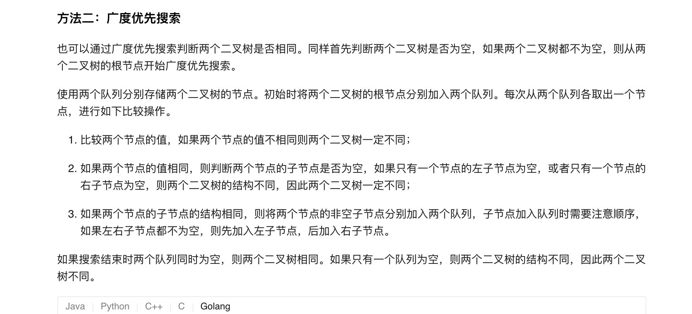
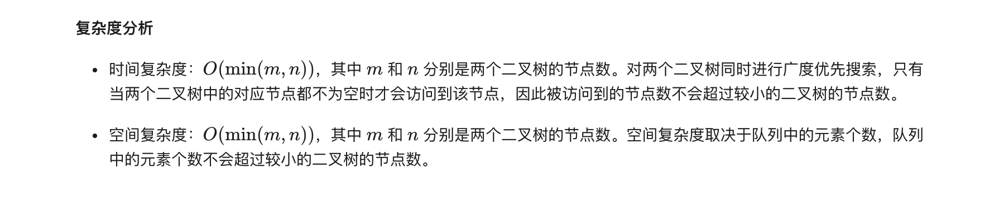

### 官方题解 [@link](https://leetcode-cn.com/problems/same-tree/solution/xiang-tong-de-shu-by-leetcode-solution/)


```Golang
func isSameTree(p *TreeNode, q *TreeNode) bool {
    if p == nil && q == nil {
        return true
    }
    if p == nil || q == nil {
        return false
    }
    if p.Val != q.Val {
        return false
    }
    return isSameTree(p.Left, q.Left) && isSameTree(p.Right, q.Right)
}
```


```golang
func isSameTree(p *TreeNode, q *TreeNode) bool {
    if p == nil && q == nil {
        return true
    }
    if p == nil || q == nil {
        return false
    }
    queue1, queue2 := []*TreeNode{p}, []*TreeNode{q}
    for len(queue1) > 0 && len(queue2) > 0 {
        node1, node2 := queue1[0], queue2[0]
        queue1, queue2 = queue1[1:], queue2[1:]
        if node1.Val != node2.Val {
            return false
        }
        left1, right1 := node1.Left, node1.Right
        left2, right2 := node2.Left, node2.Right
        if (left1 == nil && left2 != nil) || (left1 != nil && left2 == nil) {
            return false
        }
        if (right1 == nil && right2 != nil) || (right1 != nil && right2 == nil) {
            return false
        }
        if left1 != nil {
            queue1 = append(queue1, left1)
        }
        if right1 != nil {
            queue1 = append(queue1, right1)
        }
        if left2 != nil {
            queue2 = append(queue2, left2)
        }
        if right2 != nil {
            queue2 = append(queue2, right2)
        }
    }
    return len(queue1) == 0 && len(queue2) == 0
}
```
