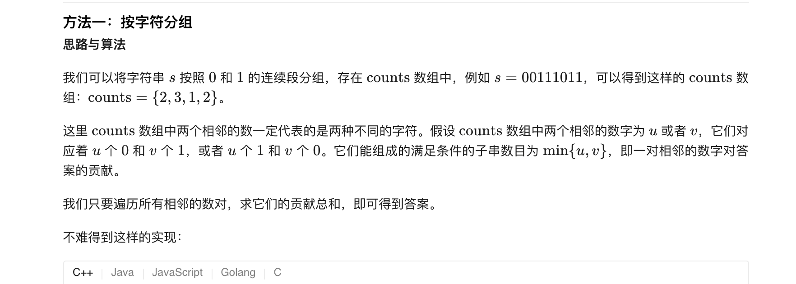
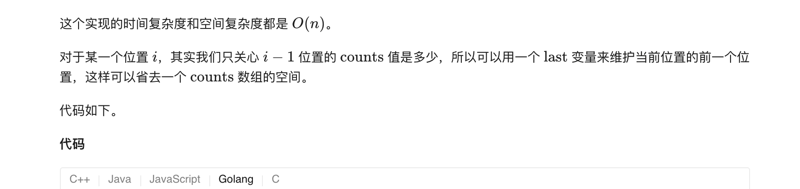
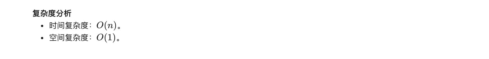

### 官方题解 [@link](https://leetcode-cn.com/problems/count-binary-substrings/solution/ji-shu-er-jin-zhi-zi-chuan-by-leetcode-solution/)


```Golang
func countBinarySubstrings(s string) int {
    counts := []int{}
    ptr, n := 0, len(s)
    for ptr < n {
        c := s[ptr]
        count := 0
        for ptr < n && s[ptr] == c {
            ptr++
            count++
        }
        counts = append(counts, count)
    }
    ans := 0
    for i := 1; i < len(counts); i++ {
        ans += min(counts[i], counts[i-1])
    }
    return ans
}

func min(x, y int) int {
    if x < y {
        return x
    }
    return y
}
```

```Golang
func countBinarySubstrings(s string) int {
    var ptr, last, ans int
    n := len(s)
    for ptr < n {
        c := s[ptr]
        count := 0
        for ptr < n && s[ptr] == c {
            ptr++
            count++
        }
        ans += min(count, last)
        last = count
    }

    return ans
}

func min(x, y int) int {
    if x < y {
        return x
    }
    return y
}
```

