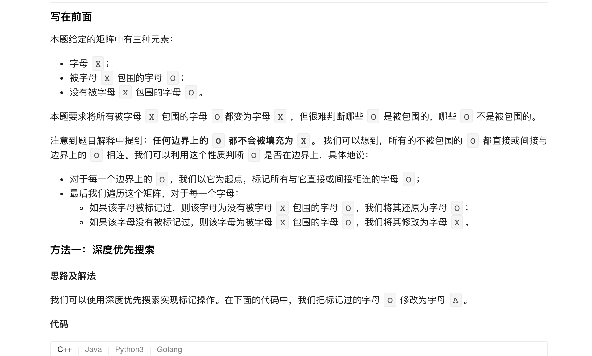
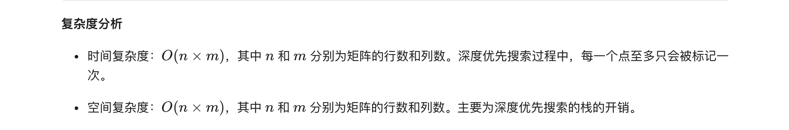
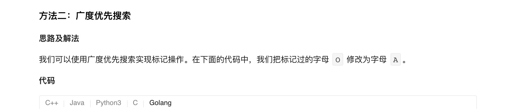
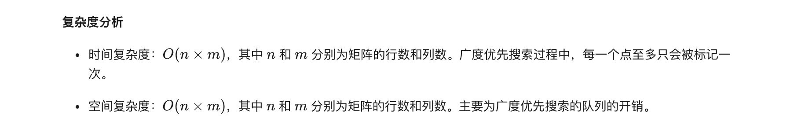

### 官方题解 [@link](https://leetcode-cn.com/problems/surrounded-regions/solution/bei-wei-rao-de-qu-yu-by-leetcode-solution/)


```Golang
var n, m int

func solve(board [][]byte)  {
    if len(board) == 0 || len(board[0]) == 0 {
        return
    }
    n, m = len(board), len(board[0])
    for i := 0; i < n; i++ {
        dfs(board, i, 0)
        dfs(board, i, m - 1)
    }
    for i := 1; i < m - 1; i++ {
        dfs(board, 0, i)
        dfs(board, n - 1, i)
    }
    for i := 0; i < n; i++ {
        for j := 0; j < m; j++ {
            if board[i][j] == 'A' {
                board[i][j] = 'O'
            } else if board[i][j] == 'O' {
                board[i][j] = 'X'
            }
        }
    }
}

func dfs(board [][]byte, x, y int) {
    if x < 0 || x >= n || y < 0 || y >= m || board[x][y] != 'O' {
        return
    }
    board[x][y] = 'A'
    dfs(board, x + 1, y)
    dfs(board, x - 1, y)
    dfs(board, x, y + 1)
    dfs(board, x, y - 1)
}
```


```Golang
var (
    dx = [4]int{1, -1, 0, 0}
    dy = [4]int{0, 0, 1, -1}
)
func solve(board [][]byte)  {
    if len(board) == 0 || len(board[0]) == 0 {
        return
    }
    n, m := len(board), len(board[0])
    queue := [][]int{}
    for i := 0; i < n; i++ {
        if board[i][0] == 'O' {
            queue = append(queue, []int{i, 0})
        }
        if board[i][m-1] == 'O' {
            queue = append(queue, []int{i, m - 1})
        }
    }
    for i := 1; i < m - 1; i++ {
        if board[0][i] == 'O' {
            queue = append(queue, []int{0, i})
        }
        if board[n-1][i] == 'O' {
            queue = append(queue, []int{n - 1, i})
        }
    }
    for len(queue) > 0 {
        cell := queue[0]
        queue = queue[1:]
        x, y := cell[0], cell[1]
        board[x][y] = 'A'
        for i := 0; i < 4; i++ {
            mx, my := x + dx[i], y + dy[i]
            if mx < 0 || my < 0 || mx >= n || my >= m || board[mx][my] != 'O' {
                continue
            }
            queue = append(queue, []int{mx, my})
        }
    }
    for i := 0; i < n; i++ {
        for j := 0; j < m; j++ {
            if board[i][j] == 'A' {
                board[i][j] = 'O'
            } else if board[i][j] == 'O' {
                board[i][j] = 'X'
            }
        }
    }
}
```
