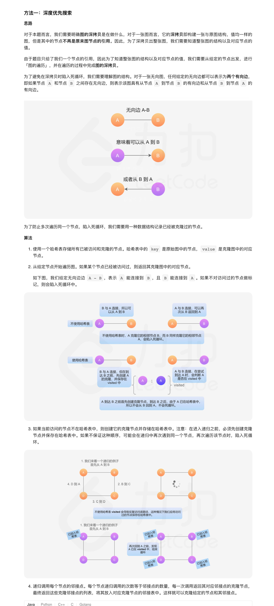
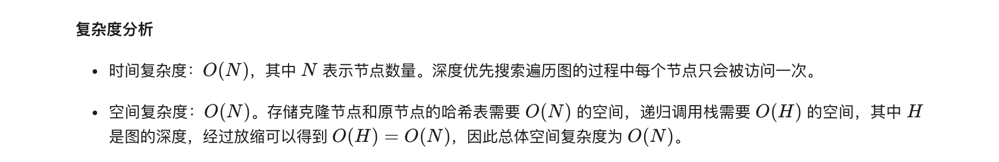
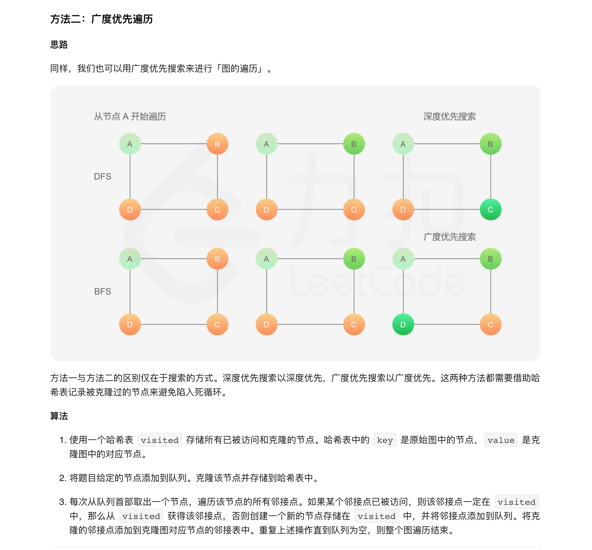
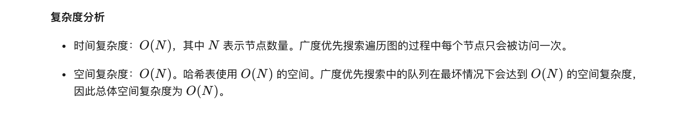

### 官方题解 [@link](https://leetcode-cn.com/problems/clone-graph/solution/ke-long-tu-by-leetcode-solution/)


```Golang
func cloneGraph(node *Node) *Node {
    visited := map[*Node]*Node{}
    var cg func(node *Node) *Node
    cg = func(node *Node) *Node {
        if node == nil {
            return node
        }

        // 如果该节点已经被访问过了，则直接从哈希表中取出对应的克隆节点返回
        if _, ok := visited[node]; ok {
            return visited[node]
        }

        // 克隆节点，注意到为了深拷贝我们不会克隆它的邻居的列表
        cloneNode := &Node{node.Val, []*Node{}}
        // 哈希表存储
        visited[node] = cloneNode

        // 遍历该节点的邻居并更新克隆节点的邻居列表
        for _, n := range node.Neighbors {
            cloneNode.Neighbors = append(cloneNode.Neighbors, cg(n))
        }
        return cloneNode
    }
    return cg(node)
}
```


```Golang
func cloneGraph(node *Node) *Node {
    if node == nil {
        return node
    }
    visited := map[*Node]*Node{}

    // 将题目给定的节点添加到队列
    queue := []*Node{node}
    // 克隆第一个节点并存储到哈希表中
    visited[node] = &Node{node.Val, []*Node{}}

    // 广度优先搜索
    for len(queue) > 0 {
        // 取出队列的头节点
        n := queue[0]
        // 遍历该节点的邻居
        queue = queue[1:]
        for _, neighbor := range n.Neighbors {
            if _, ok := visited[neighbor]; !ok {
                // 如果没有被访问过，就克隆并存储在哈希表中
                visited[neighbor] = &Node{neighbor.Val, []*Node{}}
                // 将邻居节点加入队列中
                queue = append(queue, neighbor)
            }
            // 更新当前节点的邻居列表
            visited[n].Neighbors = append(visited[n].Neighbors, visited[neighbor])
        }
    }
    return visited[node]
}
```
