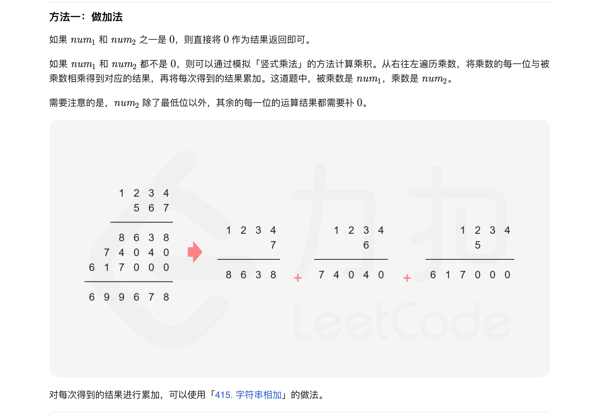
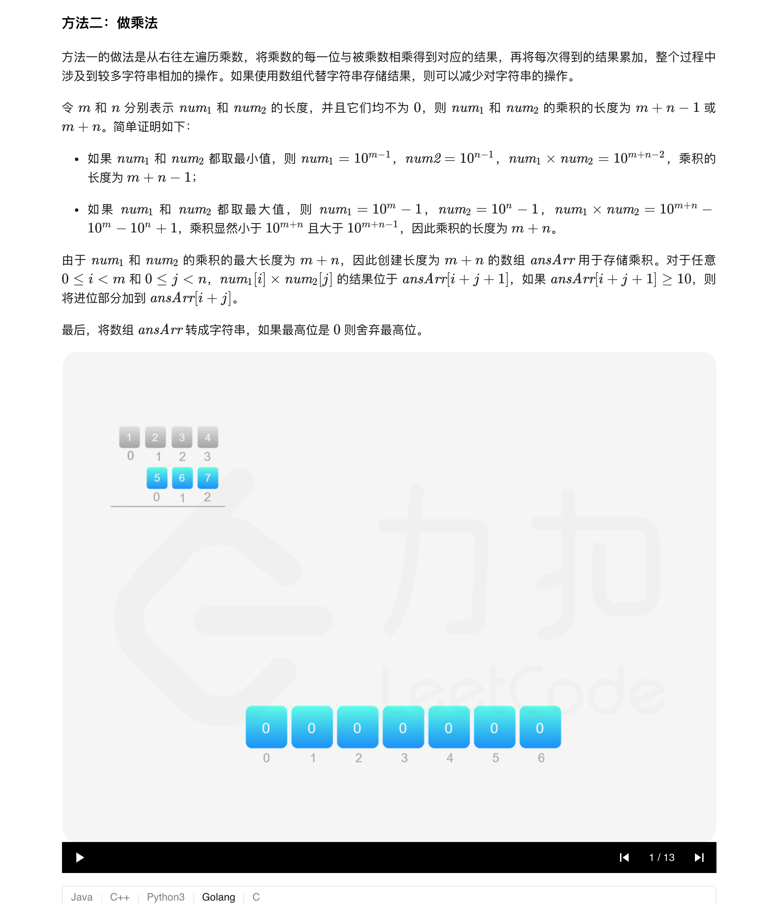
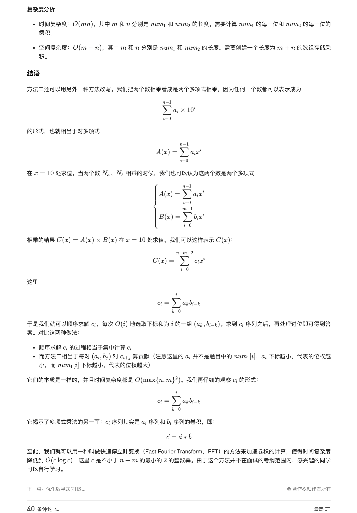

### 官方题解 [@link](https://leetcode-cn.com/problems/multiply-strings/solution/zi-fu-chuan-xiang-cheng-by-leetcode-solution/)


```Golang
func multiply(num1 string, num2 string) string {
    if num1 == "0" || num2 == "0" {
        return "0"
    }
    ans := "0"
    m, n := len(num1), len(num2)
    for i := n - 1; i >= 0; i-- {
        curr := ""
        add := 0
        for j := n - 1; j > i; j-- {
            curr += "0"
        }
        y := int(num2[i] - '0')
        for j := m - 1; j >= 0; j-- {
            x := int(num1[j] - '0')
            product := x * y + add
            curr = strconv.Itoa(product % 10) + curr
            add = product / 10
        }
        for ; add != 0; add /= 10 {
            curr = strconv.Itoa(add % 10) + curr
        }
        ans = addStrings(ans, curr)
    }
    return ans
}

func addStrings(num1, num2 string) string {
    i, j := len(num1) - 1, len(num2) - 1
    add := 0
    ans := ""
    for ; i >= 0 || j >= 0 || add != 0; i, j = i - 1, j - 1 {
        x, y := 0, 0
        if i >= 0 {
            x = int(num1[i] - '0')
        }
        if j >= 0 {
            y = int(num2[j] - '0')
        }
        result := x + y + add
        ans = strconv.Itoa(result % 10) + ans
        add = result / 10
    }
    return ans
}
```


```Golang
func multiply(num1 string, num2 string) string {
    if num1 == "0" || num2 == "0" {
        return "0"
    }
    m, n := len(num1), len(num2)
    ansArr := make([]int, m + n)
    for i := m - 1; i >= 0; i-- {
        x := int(num1[i]) - '0'
        for j := n - 1; j >= 0; j-- {
            y := int(num2[j] - '0')
            ansArr[i + j + 1] += x * y
        }
    }
    for i := m + n - 1; i > 0; i-- {
        ansArr[i - 1] += ansArr[i] / 10
        ansArr[i] %= 10
    }
    ans := ""
    idx := 0
    if ansArr[0] == 0 {
        idx = 1
    }
    for ; idx < m + n; idx++ {
        ans += strconv.Itoa(ansArr[idx])
    }
    return ans
}
```
