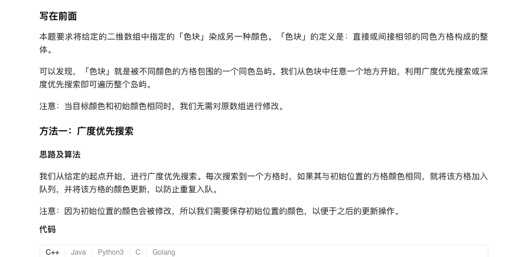
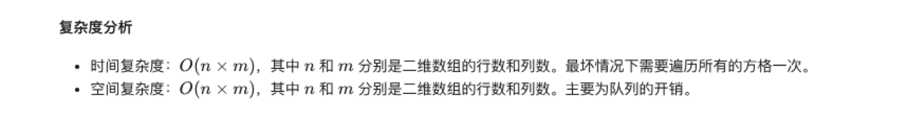
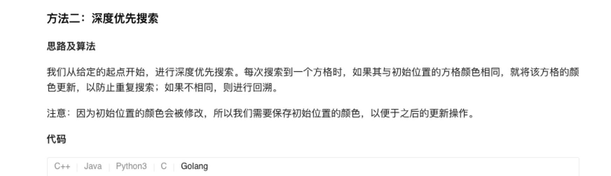

### 官方题解 [@link](https://leetcode-cn.com/problems/flood-fill/solution/tu-xiang-xuan-ran-by-leetcode-solution/)


```Golang
var (
    dx = []int{1, 0, 0, -1}
    dy = []int{0, 1, -1, 0}
)

func floodFill(image [][]int, sr int, sc int, newColor int) [][]int {
    currColor := image[sr][sc]
    if currColor == newColor {
        return image
    }
    n, m := len(image), len(image[0])
    queue := [][]int{}
    queue = append(queue, []int{sr, sc})
    image[sr][sc] = newColor
    for i := 0; i < len(queue); i++ {
        cell := queue[i]
        for j := 0; j < 4; j++ {
            mx, my := cell[0] + dx[j], cell[1] + dy[j]
            if mx >= 0 && mx < n && my >= 0 && my < m && image[mx][my] == currColor {
                queue = append(queue, []int{mx, my})
                image[mx][my] = newColor
            }
        }
    }
    return image
}
```


```Golang
var (
    dx = []int{1, 0, 0, -1}
    dy = []int{0, 1, -1, 0}
)

func floodFill(image [][]int, sr int, sc int, newColor int) [][]int {
    currColor := image[sr][sc]
    if currColor != newColor {
        dfs(image, sr, sc, currColor, newColor)
    }
    return image
}

func dfs(image [][]int, x, y, color, newColor int) {
    if image[x][y] == color {
        image[x][y] = newColor
        for i := 0; i < 4; i++ {
            mx, my := x + dx[i], y + dy[i]
            if mx >= 0 && mx < len(image) && my >= 0 && my < len(image[0]) {
                dfs(image, mx, my, color, newColor)
            }
        }
    }
}
```
