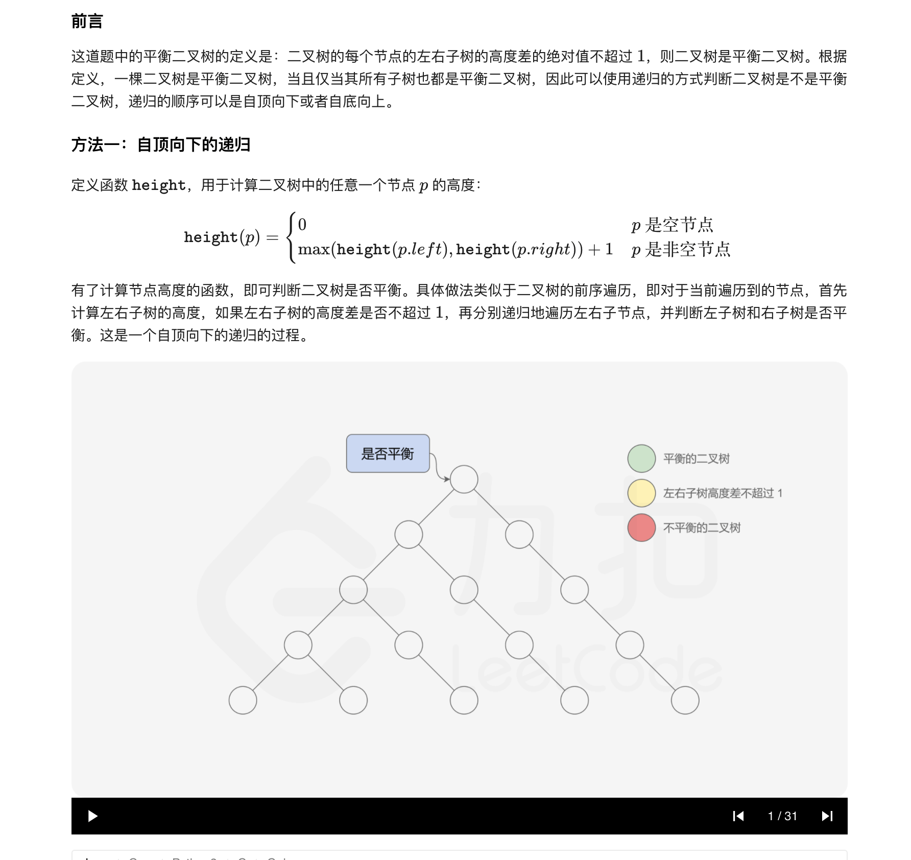
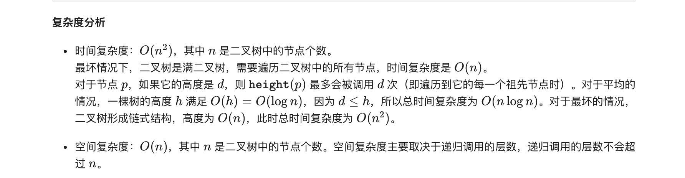
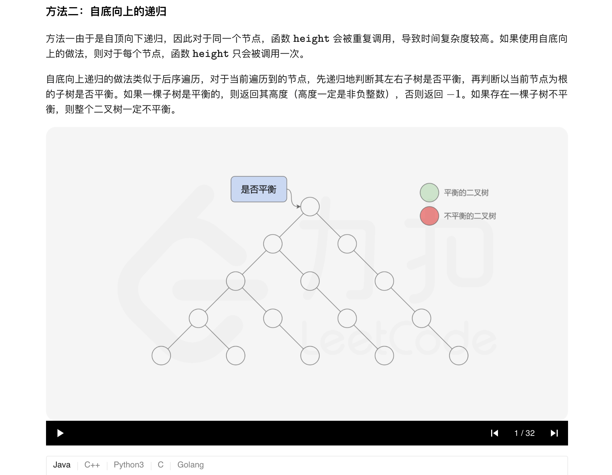
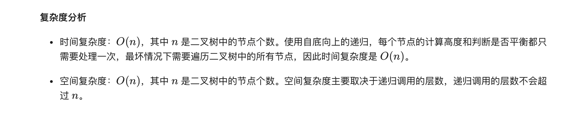

### 官方题解 [@link](https://leetcode-cn.com/problems/balanced-binary-tree/solution/ping-heng-er-cha-shu-by-leetcode-solution/)


```Golang
func isBalanced(root *TreeNode) bool {
    if root == nil {
        return true
    }
    return abs(height(root.Left) - height(root.Right)) <= 1 && isBalanced(root.Left) && isBalanced(root.Right)
}

func height(root *TreeNode) int {
    if root == nil {
        return 0
    }
    return max(height(root.Left), height(root.Right)) + 1
}

func max(x, y int) int {
    if x > y {
        return x
    }
    return y
}

func abs(x int) int {
    if x < 0 {
        return -1 * x
    }
    return x
}
```


```Golang
func isBalanced(root *TreeNode) bool {
    return height(root) >= 0
}

func height(root *TreeNode) int {
    if root == nil {
        return 0
    }
    leftHeight := height(root.Left)
    rightHeight := height(root.Right)
    if leftHeight == -1 || rightHeight == -1 || abs(leftHeight - rightHeight) > 1 {
        return -1
    }
    return max(leftHeight, rightHeight) + 1
}

func max(x, y int) int {
    if x > y {
        return x
    }
    return y
}

func abs(x int) int {
    if x < 0 {
        return -1 * x
    }
    return x
}
```
