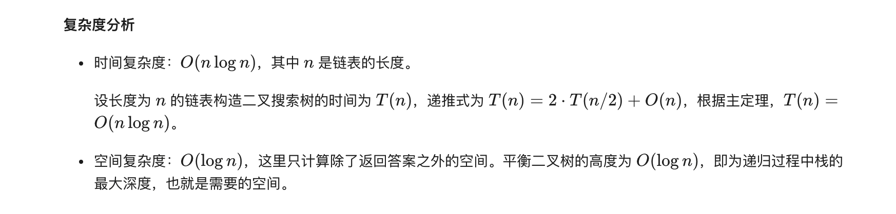

### 官方题解 [@link](https://leetcode-cn.com/problems/convert-sorted-list-to-binary-search-tree/solution/you-xu-lian-biao-zhuan-huan-er-cha-sou-suo-shu-1-3/)


```Golang
func sortedListToBST(head *ListNode) *TreeNode {
    return buildTree(head, nil)
}

func getMedian(left, right *ListNode) *ListNode {
    fast, slow := left, left
    for fast != right && fast.Next != right {
        fast = fast.Next.Next
        slow = slow.Next
    }
    return slow
}

func buildTree(left, right *ListNode) *TreeNode{
    if left == right {
        return nil
    }
    mid := getMedian(left, right)
    root := &TreeNode{mid.Val, nil, nil}
    root.Left = buildTree(left, mid)
    root.Right = buildTree(mid.Next, right)
    return root
}
```


```Golang
var globalHead *ListNode

func sortedListToBST(head *ListNode) *TreeNode {
    globalHead = head
    length := getLength(head)
    return buildTree(0, length - 1)
}

func getLength(head *ListNode) int {
    ret := 0
    for ; head != nil; head = head.Next {
        ret++
    }
    return ret
}

func buildTree(left, right int) *TreeNode {
    if left > right {
        return nil
    }
    mid := (left + right + 1) / 2
    root := &TreeNode{}
    root.Left = buildTree(left, mid - 1)
    root.Val = globalHead.Val
    globalHead = globalHead.Next
    root.Right = buildTree(mid + 1, right)
    return root
}
```
