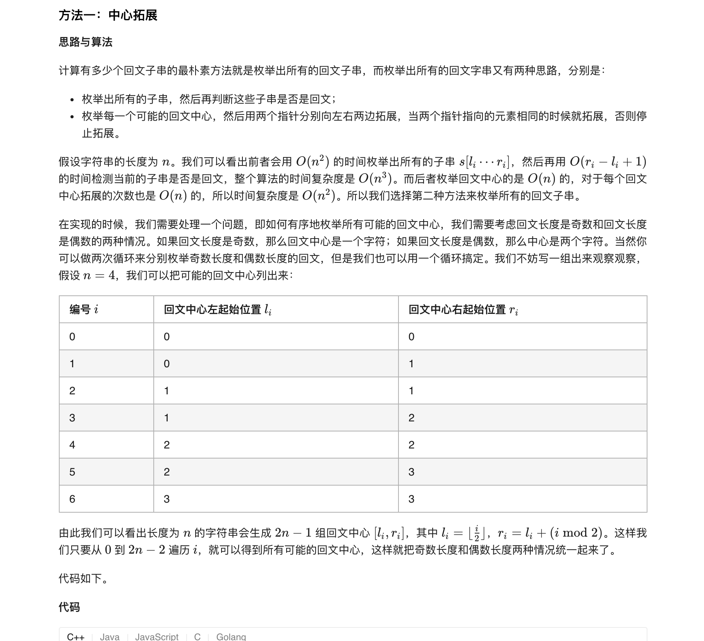
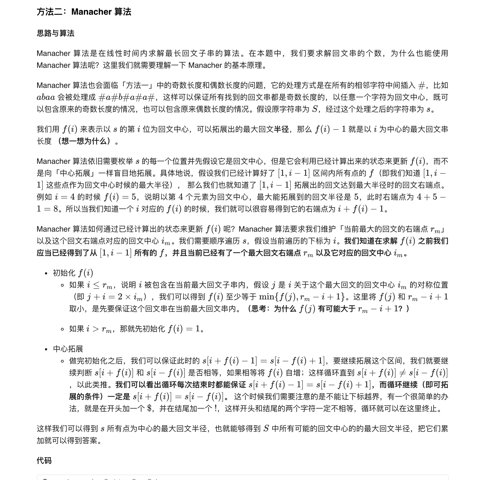
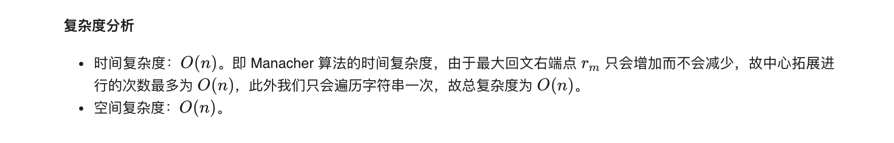

### 官方题解 [@link](https://leetcode-cn.com/problems/palindromic-substrings/solution/hui-wen-zi-chuan-by-leetcode-solution/)


```Golang
func countSubstrings(s string) int {
    n := len(s)
    ans := 0
    for i := 0; i < 2 * n - 1; i++ {
        l, r := i / 2, i / 2 + i % 2
        for l >= 0 && r < n && s[l] == s[r] {
            l--
            r++
            ans++
        }
    }
    return ans
}
```


```Golang
func countSubstrings(s string) int {
    n := len(s)
    t := "$#"
    for i := 0; i < n; i++ {
        t += string(s[i]) + "#"
    }
    n = len(t)
    t += "!"

    f := make([]int, n)
    iMax, rMax, ans := 0, 0, 0
    for i := 1; i < n; i++ {
        // 初始化 f[i]
        if i <= rMax {
            f[i] = min(rMax - i + 1, f[2 * iMax - i])
        } else {
            f[i] = 1
        }
        // 中心拓展
        for t[i + f[i]] == t[i - f[i]] {
            f[i]++
        }
        // 动态维护 iMax 和 rMax
        if i + f[i] - 1 > rMax {
            iMax = i
            rMax = i + f[i] - 1
        }
        // 统计答案, 当前贡献为 (f[i] - 1) / 2 上取整
        ans += f[i] / 2
    }
    return ans
}

func min(x, y int) int {
    if x < y {
        return x
    }
    return y
}
```
