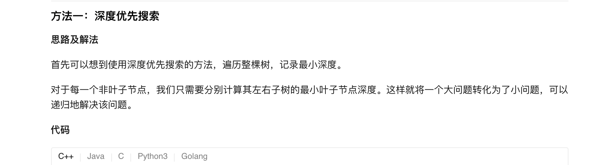
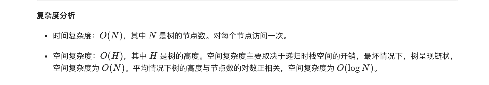
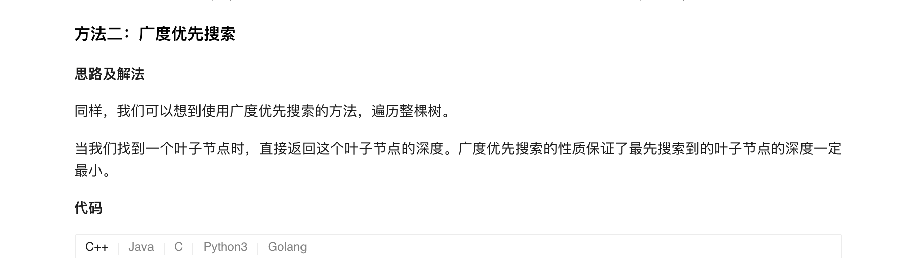
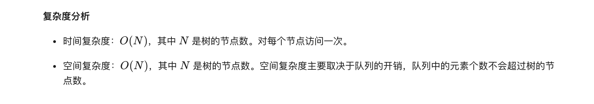

### 官方题解 [@link](https://leetcode-cn.com/problems/minimum-depth-of-binary-tree/solution/er-cha-shu-de-zui-xiao-shen-du-by-leetcode-solutio/)


```Golang
func minDepth(root *TreeNode) int {
    if root == nil {
        return 0
    }
    if root.Left == nil && root.Right == nil {
        return 1
    }
    minD := math.MaxInt32
    if root.Left != nil {
        minD = min(minDepth(root.Left), minD)
    }
    if root.Right != nil {
        minD = min(minDepth(root.Right), minD)
    }
    return minD + 1
}

func min(x, y int) int {
    if x < y {
        return x
    }
    return y
}
```


```Golang
func minDepth(root *TreeNode) int {
    if root == nil {
        return 0
    }
    queue := []*TreeNode{}
    count := []int{}
    queue = append(queue, root)
    count = append(count, 1)
    for i := 0; i < len(queue); i++ {
        node := queue[i]
        depth := count[i]
        if node.Left == nil && node.Right == nil {
            return depth
        }
        if node.Left != nil {
            queue = append(queue, node.Left)
            count = append(count, depth + 1)
        }
        if node.Right != nil {
            queue = append(queue, node.Right)
            count = append(count, depth + 1)
        }
    }
    return 0
}
```
