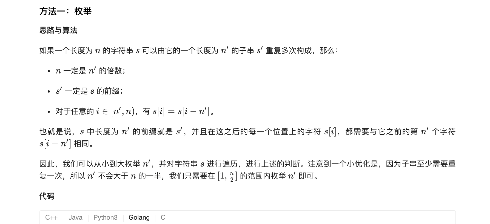

### 官方题解 [@link](https://leetcode-cn.com/problems/repeated-substring-pattern/solution/zhong-fu-de-zi-zi-fu-chuan-by-leetcode-solution/)


```Golang
func repeatedSubstringPattern(s string) bool {
    n := len(s)
    for i := 1; i * 2 <= n; i++ {
        if n % i == 0 {
            match := true
            for j := i; j < n; j++ {
                if s[j] != s[j - i] {
                    match = false
                    break
                }
            }
            if match {
                return true
            }
        }
    }
    return false
}
```


```Golang
class Solution {
    public boolean repeatedSubstringPattern(String s) {
        return (s + s).indexOf(s, 1) != s.length();
    }
}
```


```Golang
func repeatedSubstringPattern(s string) bool {
    return kmp(s + s, s)
}

func kmp(query, pattern string) bool {
    n, m := len(query), len(pattern)
    fail := make([]int, m)
    for i := 0; i < m; i++ {
        fail[i] = -1
    }
    for i := 1; i < m; i++ {
        j := fail[i - 1]
        for j != -1 && pattern[j + 1] != pattern[i] {
            j = fail[j]
        }
        if pattern[j + 1] == pattern[i] {
            fail[i] = j + 1
        }
    }
    match := -1
    for i := 1; i < n - 1; i++ {
        for match != -1 && pattern[match + 1] != query[i] {
            match = fail[match]
        }
        if pattern[match + 1] == query[i] {
            match++
            if match == m - 1 {
                return true
            }
        }
    }
    return false
}
```


```Golang
func repeatedSubstringPattern(s string) bool {
    return kmp(s)
}

func kmp(pattern string) bool {
    n := len(pattern)
    fail := make([]int, n)
    for i := 0; i < n; i++ {
        fail[i] = -1
    }
    for i := 1; i < n; i++ {
        j := fail[i - 1]
        for (j != -1 && pattern[j + 1] != pattern[i]) {
            j = fail[j]
        }
        if pattern[j + 1] == pattern[i] {
            fail[i] = j + 1
        }
    }
    return fail[n - 1] != -1 && n % (n - fail[n - 1] - 1) == 0
}
```

