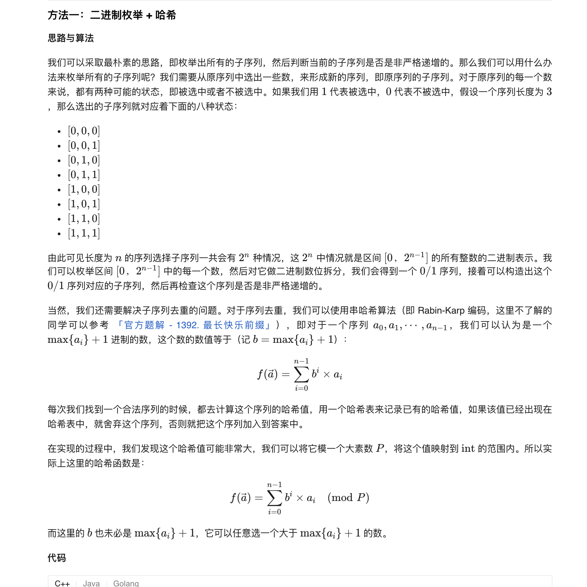

### 官方题解 [@link](https://leetcode-cn.com/problems/increasing-subsequences/solution/di-zeng-zi-xu-lie-by-leetcode-solution/)


```Golang
var (
    n int
    temp []int
)
func findSubsequences(nums []int) [][]int {
    n = len(nums)
    ans := [][]int{}
    set := map[int]bool{}
    for i := 0; i < 1 << n; i++ {
        findSubsequences1(i, nums)
        hashValue := getHash(263, int(1e9 + 7))
        if check() && !set[hashValue] {
            t := make([]int, len(temp))
            copy(t, temp)
            ans = append(ans, t)
            set[hashValue] = true
        }
    }
    return ans
}

func findSubsequences1(mask int, nums []int) {
    temp = []int{}
    for i := 0; i < n; i++ {
        if (mask & 1) != 0 {
            temp = append(temp, nums[i])
        }
        mask >>= 1
    }
}

func getHash(base, mod int) int {
    hashValue := 0
    for _, x := range temp {
        hashValue = hashValue * base % mod + (x + 101)
        hashValue %= mod
    }
    return hashValue
}

func check() bool {
    for i := 1; i < len(temp); i++ {
        if temp[i] < temp[i - 1] {
            return false
        }
    }
    return len(temp) >= 2
}
```


```C++
vector<vector<int>> ans;
vector<int> temp;
void dfs(int cur, vector<int>& nums) {
    if (cur == nums.size()) {
        // 判断是否合法，如果合法判断是否重复，将满足条件的加入答案
        if (isValid() && notVisited()) {
            ans.push_back(temp);
        }
        return;
    }
    // 如果选择当前元素
    temp.push_back(nums[cur]);
    dfs(cur + 1, nums);
    temp.pop_back();
    // 如果不选择当前元素
    dfs(cur + 1, nums);
}
```

```Golang
var (
    temp []int
    ans [][]int
)

func findSubsequences(nums []int) [][]int {
    ans = [][]int{}
    dfs(0, math.MinInt32, nums)
    return ans
}

func dfs(cur, last int, nums []int) {
    if cur == len(nums) {
        if len(temp) >= 2 {
            t := make([]int, len(temp))
            copy(t, temp)
            ans = append(ans, t)
        }
        return
    }
    if nums[cur] >= last {
        temp = append(temp, nums[cur])
        dfs(cur + 1, nums[cur], nums)
        temp = temp[:len(temp)-1]
    }
    if nums[cur] != last {
        dfs(cur + 1, last, nums)
    }
}
```
