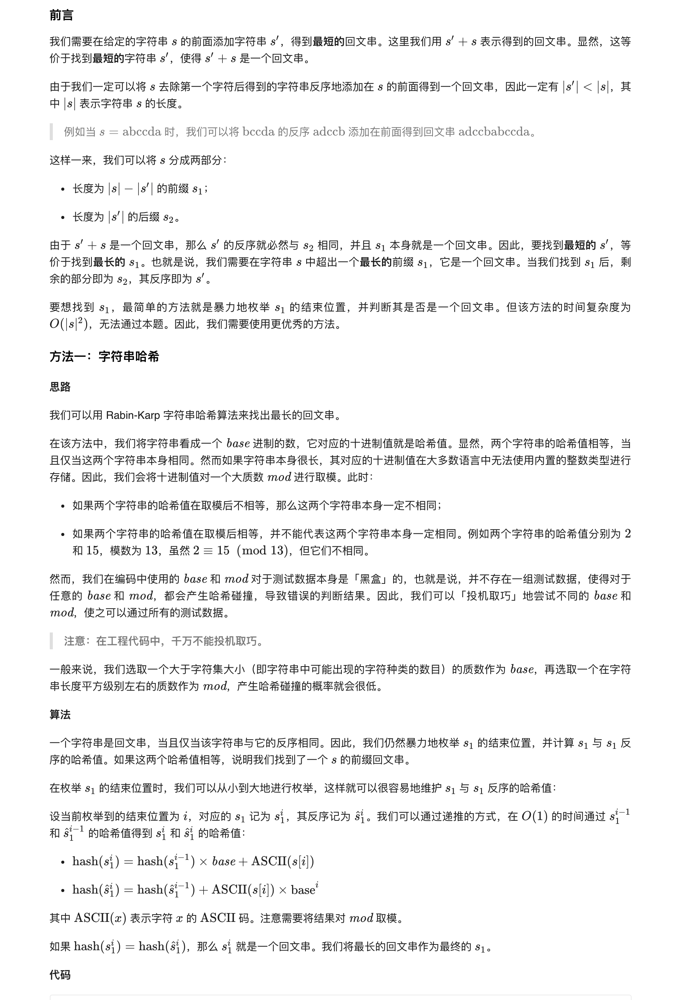
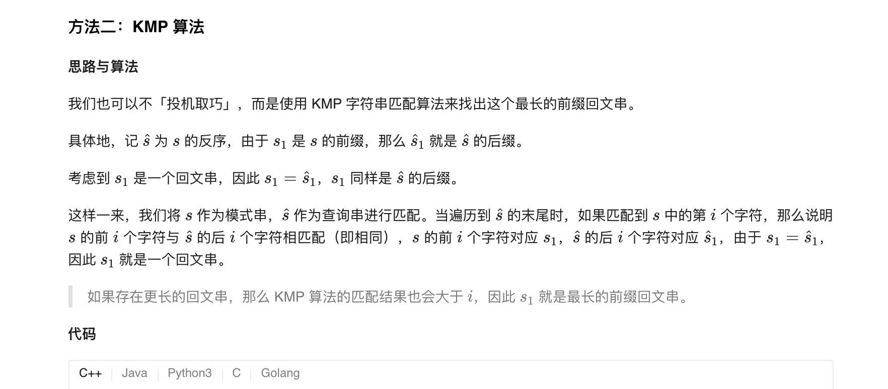

### 官方题解 [@link](https://leetcode-cn.com/problems/shortest-palindrome/solution/zui-duan-hui-wen-chuan-by-leetcode-solution/)


```Golang
func shortestPalindrome(s string) string {
    n := len(s)
    base, mod := 131, 1000000007
    left, right, mul := 0, 0, 1
    best := -1
    for i := 0; i < n; i++ {
        left = (left * base + int(s[i] - '0')) % mod
        right = (right + mul * int(s[i] - '0')) % mod
        if left == right {
            best = i
        }
        mul = mul * base % mod
    }
    add := ""
    if best != n - 1 {
        add = s[best + 1:]
    }
    b := []byte(add)
    for i := 0; i < len(b) / 2; i++ {
        b[i], b[len(b) - 1 -i] = b[len(b) - 1 -i], b[i]
    }
    return string(b) + s
}
```


```C++
func shortestPalindrome(s string) string {
    n := len(s)
    fail := make([]int, n)
    for i := 0; i < n; i++ {
        fail[i] = -1
    }
    for i := 1; i < n; i++ {
        j := fail[i - 1]
        for j != -1 && s[j + 1] != s[i] {
            j = fail[j]
        }
        if s[j + 1] == s[i] {
            fail[i] = j + 1
        }
    }
    best := -1
    for i := n - 1; i >= 0; i-- {
        for best != -1 && s[best + 1] != s[i] {
            best = fail[best]
        }
        if s[best + 1] == s[i] {
            best++
        }
    }
    add := ""
    if best != n - 1 {
        add = s[best + 1:]
    }
    b := []byte(add)
    for i := 0; i < len(b) / 2; i++ {
        b[i], b[len(b) - 1 -i] = b[len(b) - 1 -i], b[i]
    }
    return string(b) + s
}
```
