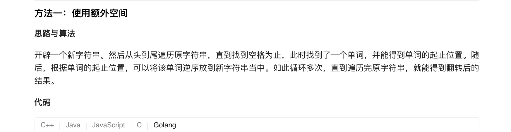
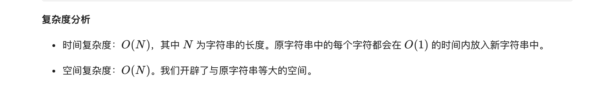
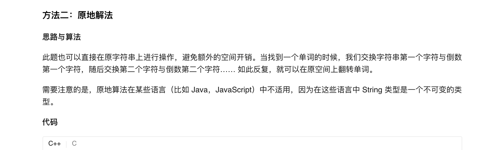
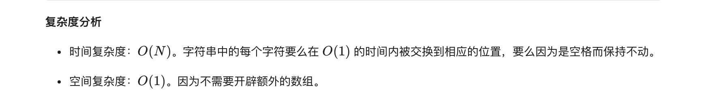

### 官方题解 [@link](https://leetcode-cn.com/problems/reverse-words-in-a-string-iii/solution/fan-zhuan-zi-fu-chuan-zhong-de-dan-ci-iii-by-lee-2/)


```Golang
func reverseWords(s string) string {
    length := len(s)
    ret := []byte{}
    for i := 0; i < length; {
        start := i
        for i < length && s[i] != ' ' {
            i++
        }
        for p := start; p < i; p++ {
            ret = append(ret, s[start + i - 1 - p])
        }
        for i < length && s[i] == ' ' {
            i++
            ret = append(ret, ' ')
        }
    }
    return string(ret)
}
```


```C++
class Solution {
public: 
    string reverseWords(string s) {
        int length = s.length();
        int i = 0;
        while (i < length) {
            int start = i;
            while (i < length && s[i] != ' ') {
                i++;
            }

            int left = start, right = i - 1;
            while (left < right) {
                swap(s[left], s[right]);
                left++;
                right--;
            }
            while (i < length && s[i] == ' ') {
                i++;
            }
        }
        return s;
    }
};
```
