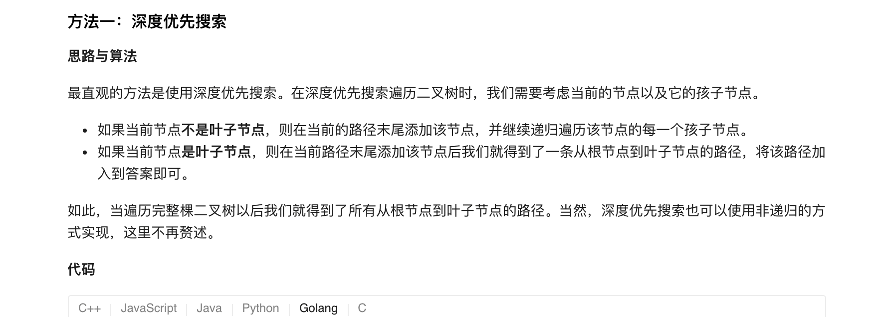
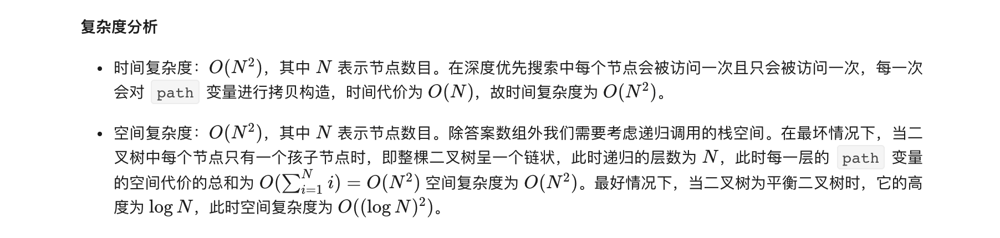

### 官方题解 [@link](https://leetcode-cn.com/problems/binary-tree-paths/solution/er-cha-shu-de-suo-you-lu-jing-by-leetcode-solution/)


```Golang
var paths []string

func binaryTreePaths(root *TreeNode) []string {
    paths = []string{}
    constructPaths(root, "")
    return paths
}

func constructPaths(root *TreeNode, path string) {
    if root != nil {
        pathSB := path
        pathSB += strconv.Itoa(root.Val)
        if root.Left == nil && root.Right == nil {
            paths = append(paths, pathSB)
        } else {
            pathSB += "->"
            constructPaths(root.Left, pathSB)
            constructPaths(root.Right, pathSB)
        }
    }
}
```


```Golang
func binaryTreePaths(root *TreeNode) []string {
    paths := []string{}
    if root == nil {
        return paths
    }
    nodeQueue := []*TreeNode{}
    pathQueue := []string{}
    nodeQueue = append(nodeQueue, root)
    pathQueue = append(pathQueue, strconv.Itoa(root.Val))

    for i := 0; i < len(nodeQueue); i++ {
        node, path := nodeQueue[i], pathQueue[i]
        if node.Left == nil && node.Right == nil {
            paths = append(paths, path)
            continue
        }
        if node.Left != nil {
            nodeQueue = append(nodeQueue, node.Left)
            pathQueue = append(pathQueue, path + "->" + strconv.Itoa(node.Left.Val))
        }
        if node.Right != nil {
            nodeQueue = append(nodeQueue, node.Right)
            pathQueue = append(pathQueue, path + "->" + strconv.Itoa(node.Right.Val))
        }
    }
    return paths
}
```
