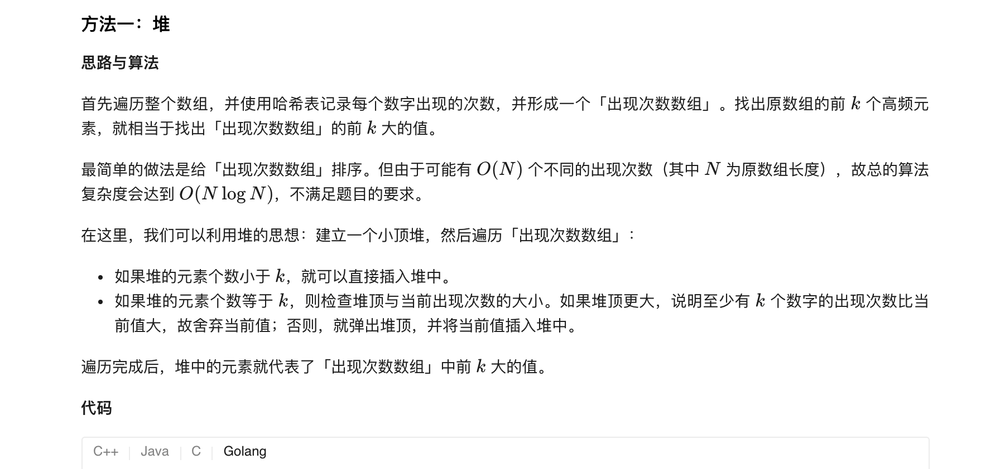
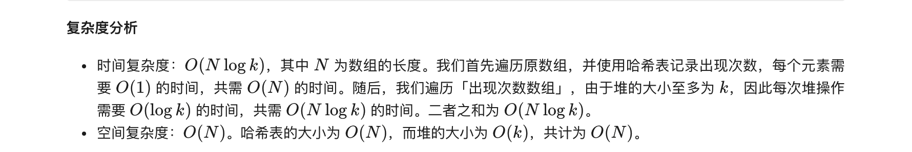
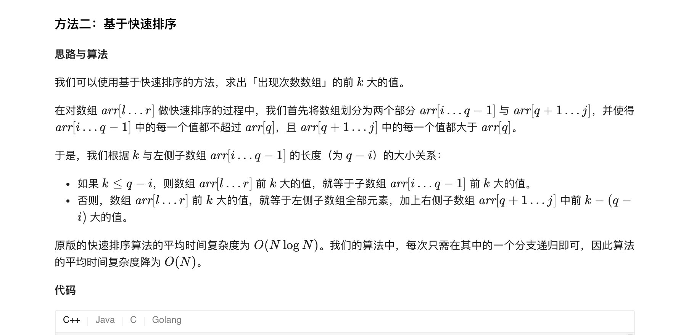
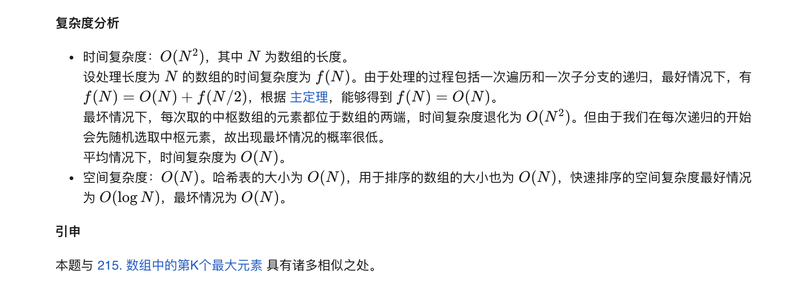

### 官方题解 [@link](https://leetcode-cn.com/problems/top-k-frequent-elements/solution/qian-k-ge-gao-pin-yuan-su-by-leetcode-solution/)


```Golang
func topKFrequent(nums []int, k int) []int {
    occurrences := map[int]int{}
    for _, num := range nums {
        occurrences[num]++
    }
    h := &IHeap{}
    heap.Init(h)
    for key, value := range occurrences {
        heap.Push(h, [2]int{key, value})
        if h.Len() > k {
            heap.Pop(h)
        }
    }
    ret := make([]int, k)
    for i := 0; i < k; i++ {
        ret[k - i - 1] = heap.Pop(h).([2]int)[0]
    }
    return ret
}

type IHeap [][2]int

func (h IHeap) Len() int           { return len(h) }
func (h IHeap) Less(i, j int) bool { return h[i][1] < h[j][1] }
func (h IHeap) Swap(i, j int)      { h[i], h[j] = h[j], h[i] }

func (h *IHeap) Push(x interface{}) {
    *h = append(*h, x.([2]int))
}

func (h *IHeap) Pop() interface{} {
    old := *h
    n := len(old)
    x := old[n-1]
    *h = old[0 : n-1]
    return x
}
```


```Golang
func topKFrequent(nums []int, k int) []int {
    occurrences := map[int]int{}
    for _, num := range nums {
        occurrences[num]++
    }
    values := [][]int{}
    for key, value := range occurrences {
        values = append(values, []int{key, value})
    }
    ret := make([]int, k)
    qsort(values, 0, len(values) - 1, ret, 0, k)
    return ret
}

func qsort(values [][]int, start, end int, ret []int, retIndex, k int) {
    rand.Seed(time.Now().UnixNano())
    picked := rand.Int() % (end - start + 1) + start;
    values[picked], values[start] = values[start], values[picked]

    pivot := values[start][1]
    index := start

    for i := start + 1; i <= end; i++ {
        if values[i][1] >= pivot {
            values[index + 1], values[i] = values[i], values[index + 1]
            index++
        }
    }
    values[start], values[index] = values[index], values[start]
    if k <= index - start {
        qsort(values, start, index - 1, ret, retIndex, k)
    } else {
        for i := start; i <= index; i++ {
            ret[retIndex] = values[i][0]
            retIndex++
        }
        if k > index - start + 1 {
            qsort(values, index + 1, end, ret, retIndex, k - (index - start + 1))
        }
    }
}
```
