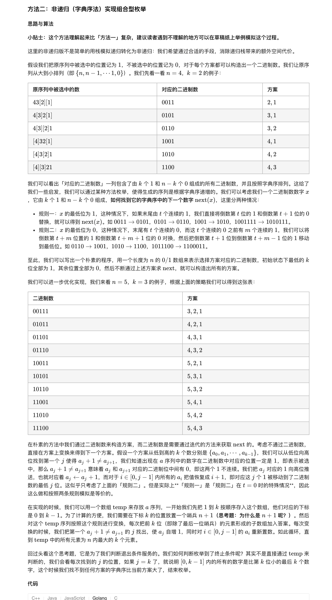

### 官方题解 [@link](https://leetcode-cn.com/problems/combinations/solution/zu-he-by-leetcode-solution/)


```c++
vector<int> temp;
void dfs(int cur, int n) {
    if (cur == n + 1) {
        // 记录答案
        // ...
        return;
    }
    // 考虑选择当前位置
    temp.push_back(cur);
    dfs(cur + 1, n, k);
    temp.pop_back();
    // 考虑不选择当前位置
    dfs(cur + 1, n, k);
}
```

```c++
vector<int> temp;
void dfs(int cur, int n) {
    // 记录合法的答案
    if (temp.size() == k) {
        ans.push_back(temp);
        return;
    }
    // cur == n + 1 的时候结束递归
    if (cur == n + 1) {
        return;
    }
    // 考虑选择当前位置
    temp.push_back(cur);
    dfs(cur + 1, n, k);
    temp.pop_back();
    // 考虑不选择当前位置
    dfs(cur + 1, n, k);
}
```

```c++
if (temp.size() + (n - cur + 1) < k) {
    return;
}
```

```c++
vector<int> temp;
void dfs(int cur, int n) {
    // 剪枝：temp 长度加上区间 [cur, n] 的长度小于 k，不可能构造出长度为 k 的 temp
    if (temp.size() + (n - cur + 1) < k) {
        return;
    }
    // 记录合法的答案
    if (temp.size() == k) {
        ans.push_back(temp);
        return;
    }
    // cur == n + 1 的时候结束递归
    if (cur == n + 1) {
        return;
    }
    // 考虑选择当前位置
    temp.push_back(cur);
    dfs(cur + 1, n, k);
    temp.pop_back();
    // 考虑不选择当前位置
    dfs(cur + 1, n, k);
}
```

```c++
func combine(n int, k int) (ans [][]int) {
	temp := []int{}
	var dfs func(int)
	dfs = func(cur int) {
		// 剪枝：temp 长度加上区间 [cur, n] 的长度小于 k，不可能构造出长度为 k 的 temp
		if len(temp) + (n - cur + 1) < k {
			return
		}
		// 记录合法的答案
		if len(temp) == k {
			comb := make([]int, k)
			copy(comb, temp)
			ans = append(ans, comb)
			return
		}
		// 考虑选择当前位置
		temp = append(temp, cur)
		dfs(cur + 1)
		temp = temp[:len(temp)-1]
		// 考虑不选择当前位置
		dfs(cur + 1)
	}
	dfs(1)
	return
}
```


```golang
func combine(n int, k int) (ans [][]int) {
	// 初始化
	// 将 temp 中 [0, k - 1] 每个位置 i 设置为 i + 1，即 [0, k - 1] 存 [1, k]
	// 末尾加一位 n + 1 作为哨兵
	temp := []int{}
	for i := 1; i <= k; i++ {
		temp = append(temp, i)
	}
	temp = append(temp, n+1)

	for j := 0; j < k; {
		comb := make([]int, k)
		copy(comb, temp[:k])
		ans = append(ans, comb)
		// 寻找第一个 temp[j] + 1 != temp[j + 1] 的位置 t
		// 我们需要把 [0, t - 1] 区间内的每个位置重置成 [1, t]
		for j = 0; j < k && temp[j]+1 == temp[j+1]; j++ {
			temp[j] = j + 1
		}
		// j 是第一个 temp[j] + 1 != temp[j + 1] 的位置
		temp[j]++
	}
	return
}
```
