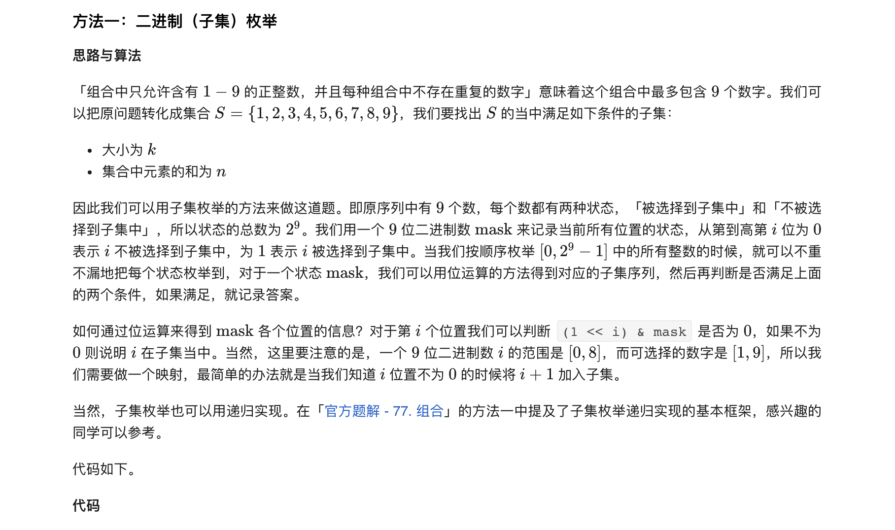
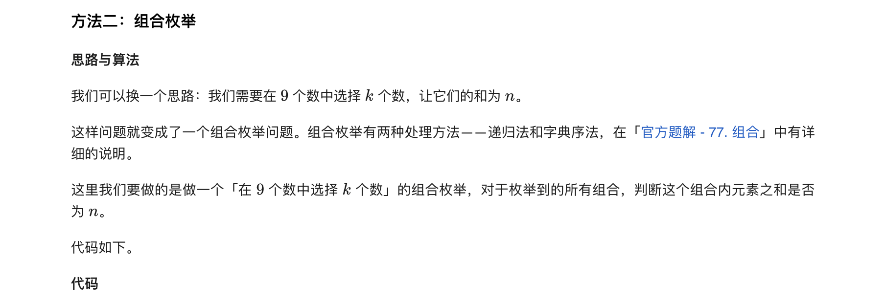
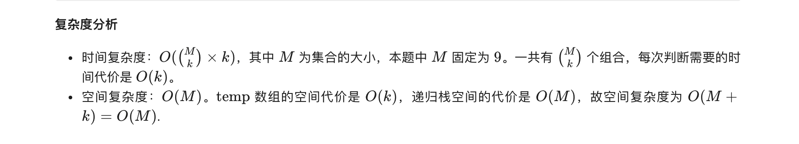

### 官方题解 [@link](https://leetcode-cn.com/problems/combination-sum-iii/solution/zu-he-zong-he-iii-by-leetcode-solution/)


```C++
func combinationSum3(k int, n int) (ans [][]int) {
	var temp []int
	check := func(mask int) bool {
		temp = nil
		sum := 0
		for i := 0; i < 9; i++ {
			if 1<<i&mask > 0 {
				temp = append(temp, i+1)
				sum += i + 1
			}
		}
		return len(temp) == k && sum == n
	}

	for mask := 0; mask < 1<<9; mask++ {
		if check(mask) {
			ans = append(ans, append([]int(nil), temp...))
		}
	}
	return
}
```


```C++
func combinationSum3(k int, n int) (ans [][]int) {
	var temp []int
	var dfs func(cur, rest int)
	dfs = func(cur, rest int) {
		// 找到一个答案
		if len(temp) == k && rest == 0 {
			ans = append(ans, append([]int(nil), temp...))
			return
		}
		// 剪枝：跳过的数字过多，后面已经无法选到 k 个数字
		if len(temp)+10-cur < k || rest < 0 {
			return
		}
		// 跳过当前数字
		dfs(cur+1, rest)
		// 选当前数字
		temp = append(temp, cur)
		dfs(cur+1, rest-cur)
		temp = temp[:len(temp)-1]
	}
	dfs(1, n)
	return
}
```
