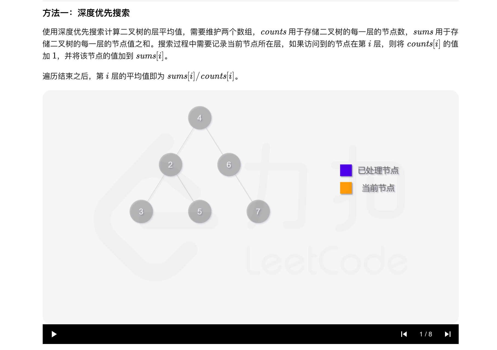

### 官方题解 [@link](https://leetcode-cn.com/problems/average-of-levels-in-binary-tree/solution/er-cha-shu-de-ceng-ping-jun-zhi-by-leetcode-soluti/)


```Golang
type data struct{ sum, count int }

func averageOfLevels(root *TreeNode) []float64 {
	levelData := []data{}
	var dfs func(node *TreeNode, level int)
	dfs = func(node *TreeNode, level int) {
		if node == nil {
			return
		}
		if level < len(levelData) {
			levelData[level].sum += node.Val
			levelData[level].count++
		} else {
			levelData = append(levelData, data{node.Val, 1})
		}
		dfs(node.Left, level+1)
		dfs(node.Right, level+1)
	}
	dfs(root, 0)

	averages := make([]float64, len(levelData))
	for i, d := range levelData {
		averages[i] = float64(d.sum) / float64(d.count)
	}
	return averages
}
```


```Golang
func averageOfLevels(root *TreeNode) (averages []float64) {
	nextLevel := []*TreeNode{root}
	for len(nextLevel) > 0 {
		sum := 0
		curLevel := nextLevel
		nextLevel = nil
		for _, node := range curLevel {
			sum += node.Val
			if node.Left != nil {
				nextLevel = append(nextLevel, node.Left)
			}
			if node.Right != nil {
				nextLevel = append(nextLevel, node.Right)
			}
		}
		averages = append(averages, float64(sum)/float64(len(curLevel)))
	}
	return
}
```
