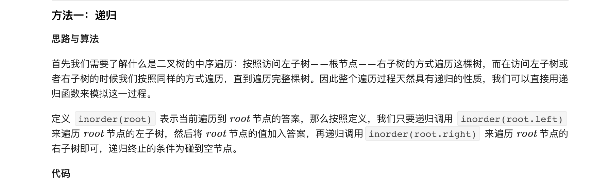
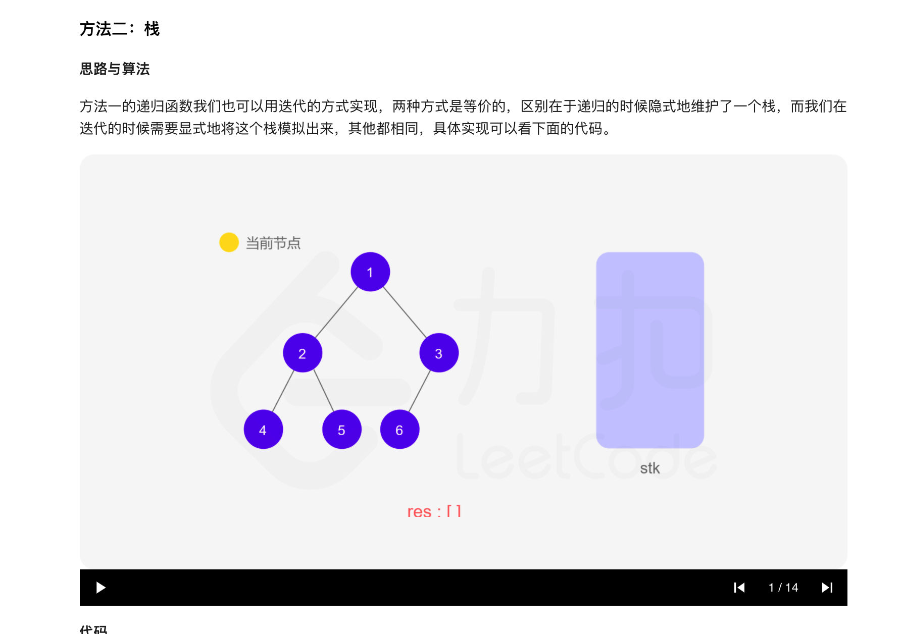
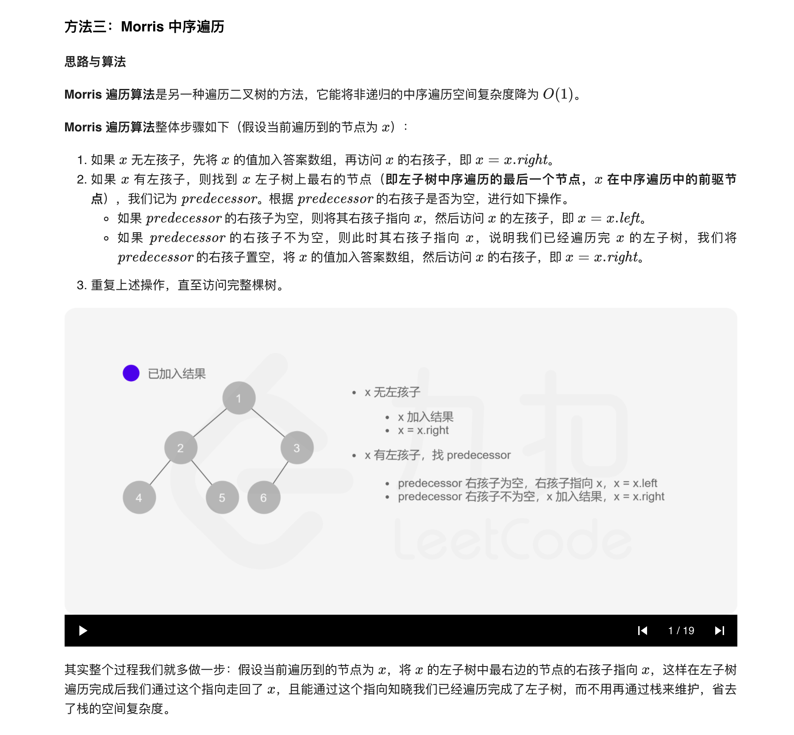
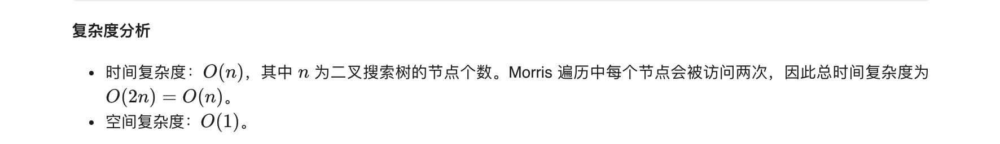

### 官方题解 [@link](https://leetcode-cn.com/problems/binary-tree-inorder-traversal/solution/er-cha-shu-de-zhong-xu-bian-li-by-leetcode-solutio/)


```Golang
func inorderTraversal(root *TreeNode) (res []int) {
	var inorder func(node *TreeNode)
	inorder = func(node *TreeNode) {
		if node == nil {
			return
		}
		inorder(node.Left)
		res = append(res, node.Val)
		inorder(node.Right)
	}
	inorder(root)
	return
}
```


```Golang
func inorderTraversal(root *TreeNode) (res []int) {
	stack := []*TreeNode{}
	for root != nil || len(stack) > 0 {
		for root != nil {
			stack = append(stack, root)
			root = root.Left
		}
		root = stack[len(stack)-1]
		stack = stack[:len(stack)-1]
		res = append(res, root.Val)
		root = root.Right
	}
	return
}
```


```Golang
func inorderTraversal(root *TreeNode) (res []int) {
	for root != nil {
		if root.Left != nil {
			// predecessor 节点表示当前 root 节点向左走一步，然后一直向右走至无法走为止的节点
			predecessor := root.Left
			for predecessor.Right != nil && predecessor.Right != root {
				// 有右子树且没有设置过指向 root，则继续向右走
				predecessor = predecessor.Right
			}
			if predecessor.Right == nil {
				// 将 predecessor 的右指针指向 root，这样后面遍历完左子树 root.Left 后，就能通过这个指向回到 root
				predecessor.Right = root
				// 遍历左子树
				root = root.Left
			} else { // predecessor 的右指针已经指向了 root，则表示左子树 root.Left 已经访问完了
				res = append(res, root.Val)
				// 恢复原样
				predecessor.Right = nil
				// 遍历右子树
				root = root.Right
			}
		} else { // 没有左子树
			res = append(res, root.Val)
			// 若有右子树，则遍历右子树
			// 若没有右子树，则整颗左子树已遍历完，root 会通过之前设置的指向回到这颗子树的父节点
			root = root.Right
		}
	}
	return
}
```
