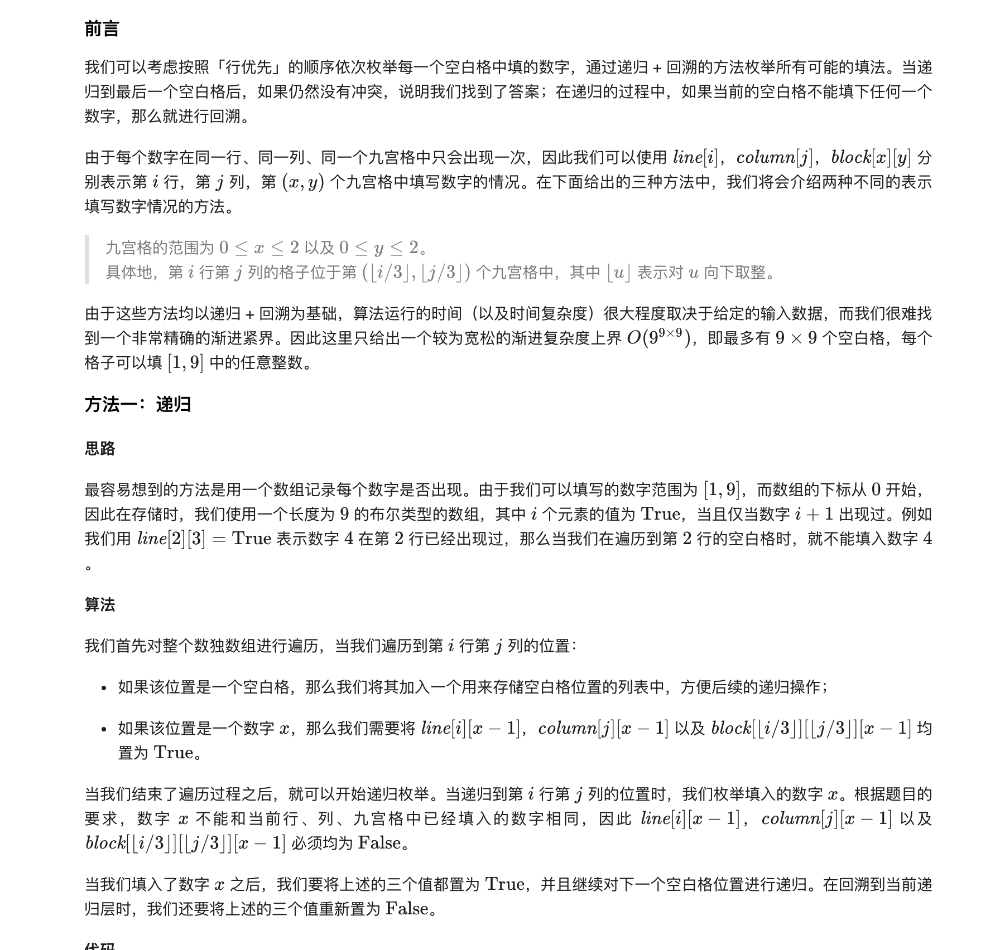

### 官方题解 [@link](https://leetcode-cn.com/problems/sudoku-solver/solution/jie-shu-du-by-leetcode-solution/)


```Golang
func solveSudoku(board [][]byte) {
    var line, column [9][9]bool
    var block [3][3][9]bool
    var spaces [][2]int

    for i, row := range board {
        for j, b := range row {
            if b == '.' {
                spaces = append(spaces, [2]int{i, j})
            } else {
                digit := b - '1'
                line[i][digit] = true
                column[j][digit] = true
                block[i/3][j/3][digit] = true
            }
        }
    }

    var dfs func(int) bool
    dfs = func(pos int) bool {
        if pos == len(spaces) {
            return true
        }
        i, j := spaces[pos][0], spaces[pos][1]
        for digit := byte(0); digit < 9; digit++ {
            if !line[i][digit] && !column[j][digit] && !block[i/3][j/3][digit] {
                line[i][digit] = true
                column[j][digit] = true
                block[i/3][j/3][digit] = true
                board[i][j] = digit + '1'
                if dfs(pos + 1) {
                    return true
                }
                line[i][digit] = false
                column[j][digit] = false
                block[i/3][j/3][digit] = false
            }
        }
        return false
    }
    dfs(0)
}
```

```Golang
func solveSudoku(board [][]byte) {
    var line, column [9]int
    var block [3][3]int
    var spaces [][2]int

    flip := func(i, j int, digit byte) {
        line[i] ^= 1 << digit
        column[j] ^= 1 << digit
        block[i/3][j/3] ^= 1 << digit
    }

    for i, row := range board {
        for j, b := range row {
            if b == '.' {
                spaces = append(spaces, [2]int{i, j})
            } else {
                digit := b - '1'
                flip(i, j, digit)
            }
        }
    }

    var dfs func(int) bool
    dfs = func(pos int) bool {
        if pos == len(spaces) {
            return true
        }
        i, j := spaces[pos][0], spaces[pos][1]
        mask := 0x1ff &^ uint(line[i]|column[j]|block[i/3][j/3]) // 0x1ff 即二进制的 9 个 1
        for ; mask > 0; mask &= mask - 1 { // 最右侧的 1 置为 0
            digit := byte(bits.TrailingZeros(mask))
            flip(i, j, digit)
            board[i][j] = digit + '1'
            if dfs(pos + 1) {
                return true
            }
            flip(i, j, digit)
        }
        return false
    }
    dfs(0)
}
```

```Golang
func solveSudoku(board [][]byte) {
    var line, column [9]int
    var block [3][3]int
    var spaces [][2]int

    flip := func(i, j int, digit byte) {
        line[i] ^= 1 << digit
        column[j] ^= 1 << digit
        block[i/3][j/3] ^= 1 << digit
    }

    for i, row := range board {
        for j, b := range row {
            if b != '.' {
                digit := b - '1'
                flip(i, j, digit)
            }
        }
    }

    for {
        modified := false
        for i, row := range board {
            for j, b := range row {
                if b != '.' {
                    continue
                }
                mask := 0x1ff &^ uint(line[i]|column[j]|block[i/3][j/3])
                if mask&(mask-1) == 0 { // mask 的二进制表示仅有一个 1
                    digit := byte(bits.TrailingZeros(mask))
                    flip(i, j, digit)
                    board[i][j] = digit + '1'
                    modified = true
                }
            }
        }
        if !modified {
            break
        }
    }

    for i, row := range board {
        for j, b := range row {
            if b == '.' {
                spaces = append(spaces, [2]int{i, j})
            }
        }
    }

    var dfs func(int) bool
    dfs = func(pos int) bool {
        if pos == len(spaces) {
            return true
        }
        i, j := spaces[pos][0], spaces[pos][1]
        mask := 0x1ff &^ uint(line[i]|column[j]|block[i/3][j/3]) // 0x1ff 即二进制的 9 个 1
        for ; mask > 0; mask &= mask - 1 { // 最右侧的 1 置为 0
            digit := byte(bits.TrailingZeros(mask))
            flip(i, j, digit)
            board[i][j] = digit + '1'
            if dfs(pos + 1) {
                return true
            }
            flip(i, j, digit)
        }
        return false
    }
    dfs(0)
}
```