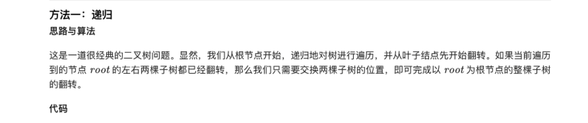
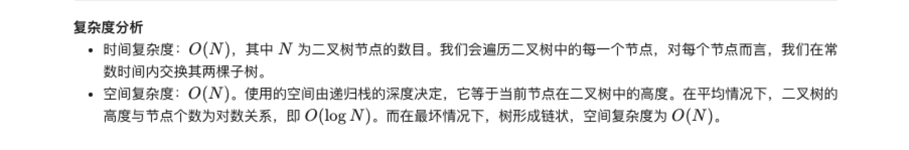

### 官方题解 [@link](https://leetcode-cn.com/problems/invert-binary-tree/solution/fan-zhuan-er-cha-shu-by-leetcode-solution/)


```Golang
func invertTree(root *TreeNode) *TreeNode {
    if root == nil {
        return nil
    }
    left := invertTree(root.Left)
    right := invertTree(root.Right)
    root.Left = right
    root.Right = left
    return root
}
```
