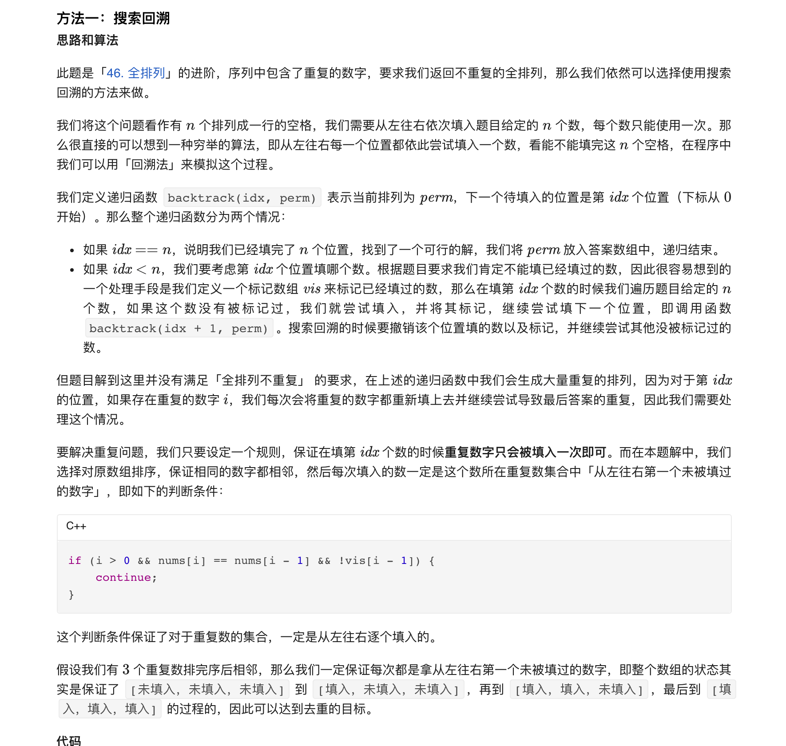
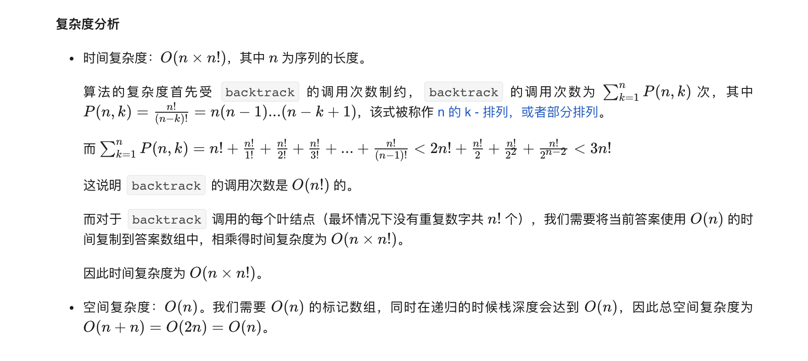

### 官方题解 [@link](https://leetcode-cn.com/problems/permutations-ii/solution/quan-pai-lie-ii-by-leetcode-solution/)


```Golang
func permuteUnique(nums []int) (ans [][]int) {
    sort.Ints(nums)
    n := len(nums)
    perm := []int{}
    vis := make([]bool, n)
    var backtrack func(int)
    backtrack = func(idx int) {
        if idx == n {
            ans = append(ans, append([]int(nil), perm...))
            return
        }
        for i, v := range nums {
            if vis[i] || i > 0 && !vis[i-1] && v == nums[i-1] {
                continue
            }
            perm = append(perm, v)
            vis[i] = true
            backtrack(idx + 1)
            vis[i] = false
            perm = perm[:len(perm)-1]
        }
    }
    backtrack(0)
    return
}
```
