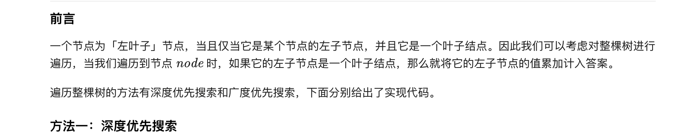
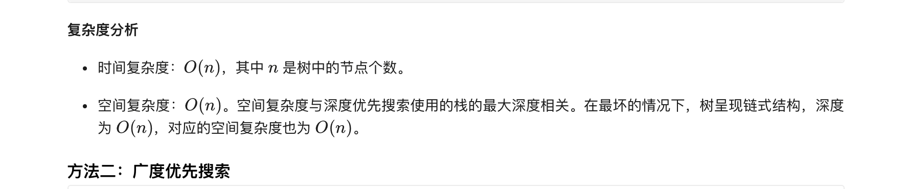
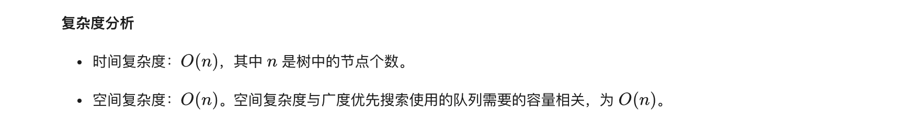

### 官方题解 [@link](https://leetcode-cn.com/problems/sum-of-left-leaves/solution/zuo-xie-zi-zhi-he-by-leetcode-solution/)


```Golang
func isLeafNode(node *TreeNode) bool {
    return node.Left == nil && node.Right == nil
}

func dfs(node *TreeNode) (ans int) {
    if node.Left != nil {
        if isLeafNode(node.Left) {
            ans += node.Left.Val
        } else {
            ans += dfs(node.Left)
        }
    }
    if node.Right != nil && !isLeafNode(node.Right) {
        ans += dfs(node.Right)
    }
    return
}

func sumOfLeftLeaves(root *TreeNode) int {
    if root == nil {
        return 0
    }
    return dfs(root)
}
```

```
func isLeafNode(node *TreeNode) bool {
    return node.Left == nil && node.Right == nil
}

func sumOfLeftLeaves(root *TreeNode) (ans int) {
    if root == nil {
        return
    }
    q := []*TreeNode{root}
    for len(q) > 0 {
        node := q[0]
        q = q[1:]
        if node.Left != nil {
            if isLeafNode(node.Left) {
                ans += node.Left.Val
            } else {
                q = append(q, node.Left)
            }
        }
        if node.Right != nil && !isLeafNode(node.Right) {
            q = append(q, node.Right)
        }
    }
    return
}
```
