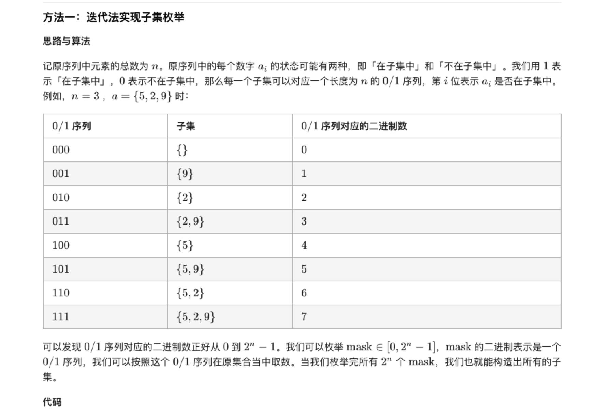
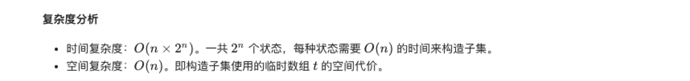
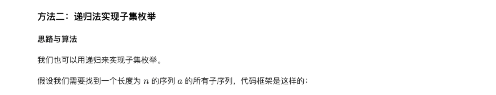
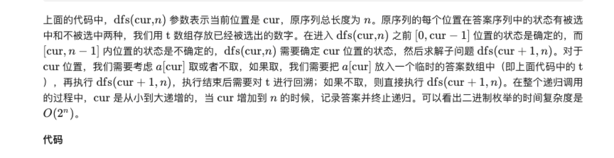
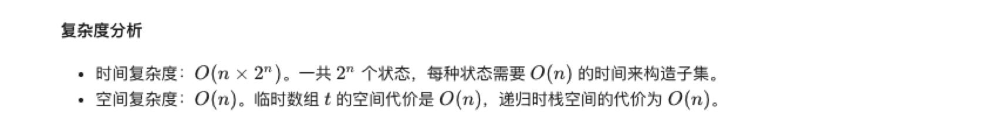

### 官方题解 [@link](https://leetcode-cn.com/problems/subsets/solution/zi-ji-by-leetcode-solution/)


```Golang
func subsets(nums []int) (ans [][]int) {
    n := len(nums)
    for mask := 0; mask < 1<<n; mask++ {
        set := []int{}
        for i, v := range nums {
            if mask>>i&1 > 0 {
                set = append(set, v)
            }
        }
        ans = append(ans, append([]int(nil), set...))
    }
    return
}
```


```C++
vector<int> t;
void dfs(int cur, int n) {
    if (cur == n) {
        // 记录答案
        // ...
        return;
    }
    // 考虑选择当前位置
    t.push_back(cur);
    dfs(cur + 1, n, k);
    t.pop_back();
    // 考虑不选择当前位置
    dfs(cur + 1, n, k);
}
```

```Golang
func subsets(nums []int) (ans [][]int) {
    set := []int{}
    var dfs func(int)
    dfs = func(cur int) {
        if cur == len(nums) {
            ans = append(ans, append([]int(nil), set...))
            return
        }
        set = append(set, nums[cur])
        dfs(cur + 1)
        set = set[:len(set)-1]
        dfs(cur + 1)
    }
    dfs(0)
    return
}
```
