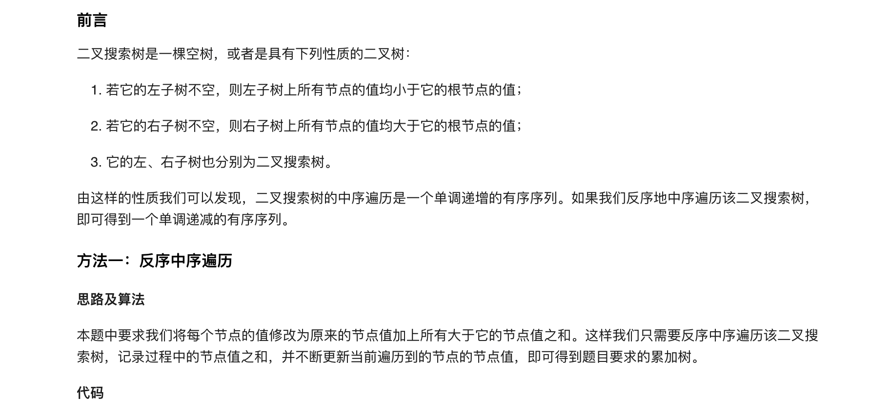
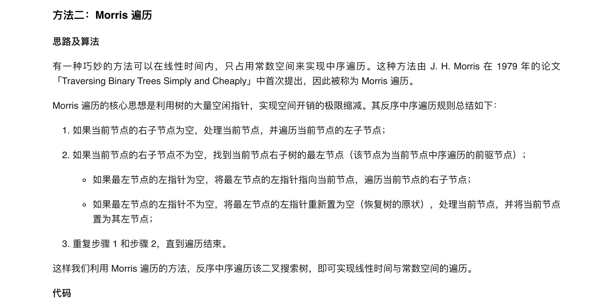
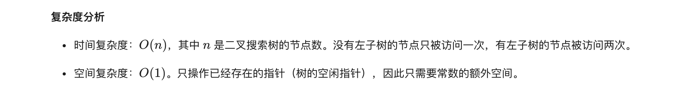

### 官方题解 [@link](https://leetcode-cn.com/problems/convert-bst-to-greater-tree/solution/ba-er-cha-sou-suo-shu-zhuan-huan-wei-lei-jia-sh-14/)


```Golang
func convertBST(root *TreeNode) *TreeNode {
    sum := 0
    var dfs func(*TreeNode)
    dfs = func(node *TreeNode) {
        if node != nil {
            dfs(node.Right)
            sum += node.Val
            node.Val = sum
            dfs(node.Left)
        }
    }
    dfs(root)
    return root
}
```


```Golang
func getSuccessor(node *TreeNode) *TreeNode {
    succ := node.Right
    for succ.Left != nil && succ.Left != node {
        succ = succ.Left
    }
    return succ
}

func convertBST(root *TreeNode) *TreeNode {
    sum := 0
    node := root
    for node != nil {
        if node.Right == nil {
            sum += node.Val
            node.Val = sum
            node = node.Left
        } else {
            succ := getSuccessor(node)
            if succ.Left == nil {
                succ.Left = node
                node = node.Right
            } else {
                succ.Left = nil
                sum += node.Val
                node.Val = sum
                node = node.Left
            }
        }
    }
    return root
}
```
