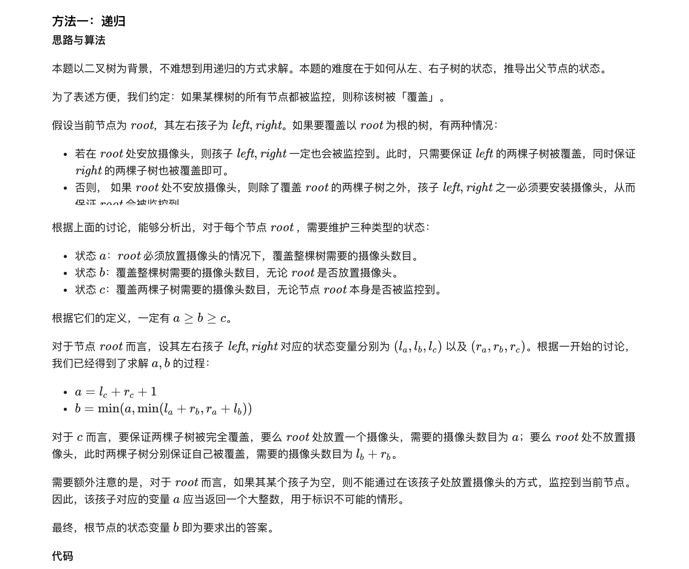
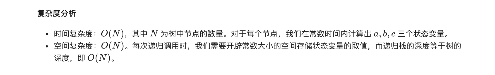

### 官方题解 [@link](https://leetcode-cn.com/problems/binary-tree-cameras/solution/jian-kong-er-cha-shu-by-leetcode-solution/)


```Golang
const inf = math.MaxInt32 / 2 // 或 math.MaxInt64 / 2

func minCameraCover(root *TreeNode) int {
    var dfs func(*TreeNode) (a, b, c int)
    dfs = func(node *TreeNode) (a, b, c int) {
        if node == nil {
            return inf, 0, 0
        }
        la, lb, lc := dfs(node.Left)
        ra, rb, rc := dfs(node.Right)
        a = lc + rc + 1
        b = min(a, min(la+rb, ra+lb))
        c = min(a, lb+rb)
        return
    }
    _, ans, _ := dfs(root)
    return ans
}

func min(a, b int) int {
    if a < b {
        return a
    }
    return b
}
```
