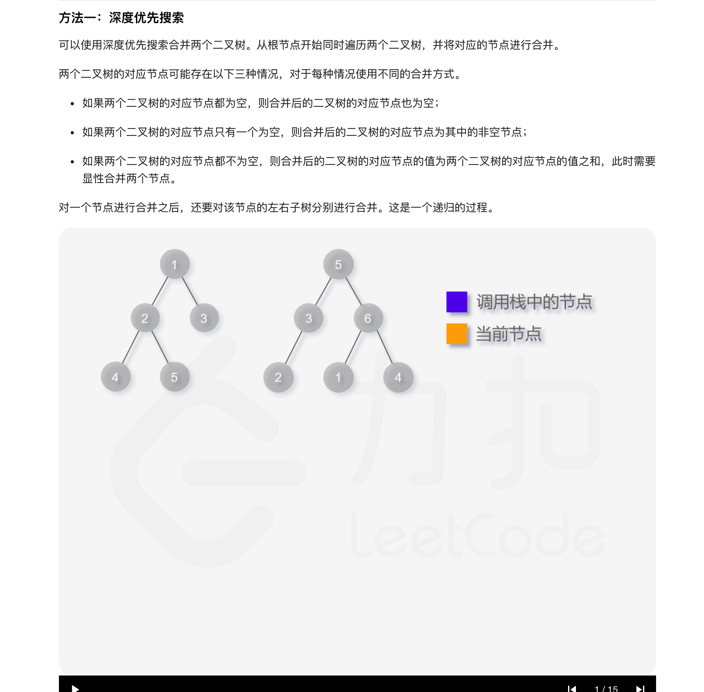
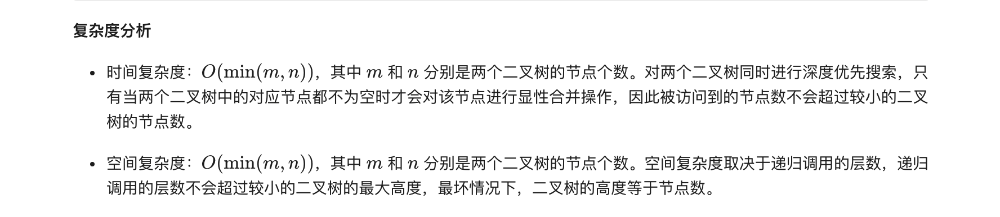
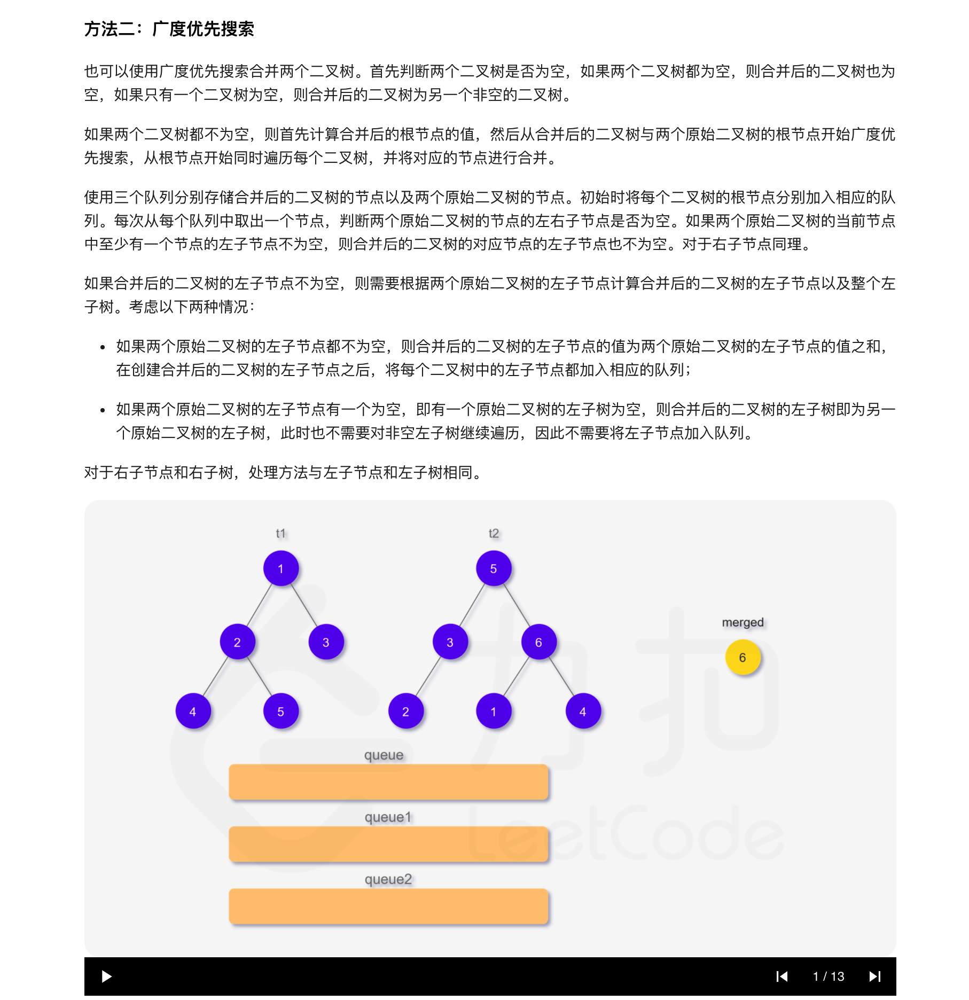

### 官方题解 [@link](https://leetcode-cn.com/problems/merge-two-binary-trees/solution/he-bing-er-cha-shu-by-leetcode-solution/)


```Golang
func mergeTrees(t1, t2 *TreeNode) *TreeNode {
    if t1 == nil {
        return t2
    }
    if t2 == nil {
        return t1
    }
    t1.Val += t2.Val
    t1.Left = mergeTrees(t1.Left, t2.Left)
    t1.Right = mergeTrees(t1.Right, t2.Right)
    return t1
}
```


```Golang
func mergeTrees(t1, t2 *TreeNode) *TreeNode {
    if t1 == nil {
        return t2
    }
    if t2 == nil {
        return t1
    }
    merged := &TreeNode{Val: t1.Val + t2.Val}
    queue := []*TreeNode{merged}
    queue1 := []*TreeNode{t1}
    queue2 := []*TreeNode{t2}
    for len(queue1) > 0 && len(queue2) > 0 {
        node := queue[0]
        queue = queue[1:]
        node1 := queue1[0]
        queue1 = queue1[1:]
        node2 := queue2[0]
        queue2 = queue2[1:]
        left1, right1 := node1.Left, node1.Right
        left2, right2 := node2.Left, node2.Right
        if left1 != nil || left2 != nil {
            if left1 != nil && left2 != nil {
                left := &TreeNode{Val: left1.Val + left2.Val}
                node.Left = left
                queue = append(queue, left)
                queue1 = append(queue1, left1)
                queue2 = append(queue2, left2)
            } else if left1 != nil {
                node.Left = left1
            } else { // left2 != nil
                node.Left = left2
            }
        }
        if right1 != nil || right2 != nil {
            if right1 != nil && right2 != nil {
                right := &TreeNode{Val: right1.Val + right2.Val}
                node.Right = right
                queue = append(queue, right)
                queue1 = append(queue1, right1)
                queue2 = append(queue2, right2)
            } else if right1 != nil {
                node.Right = right1
            } else { // right2 != nil
                node.Right = right2
            }
        }
    }
    return merged
}
```
