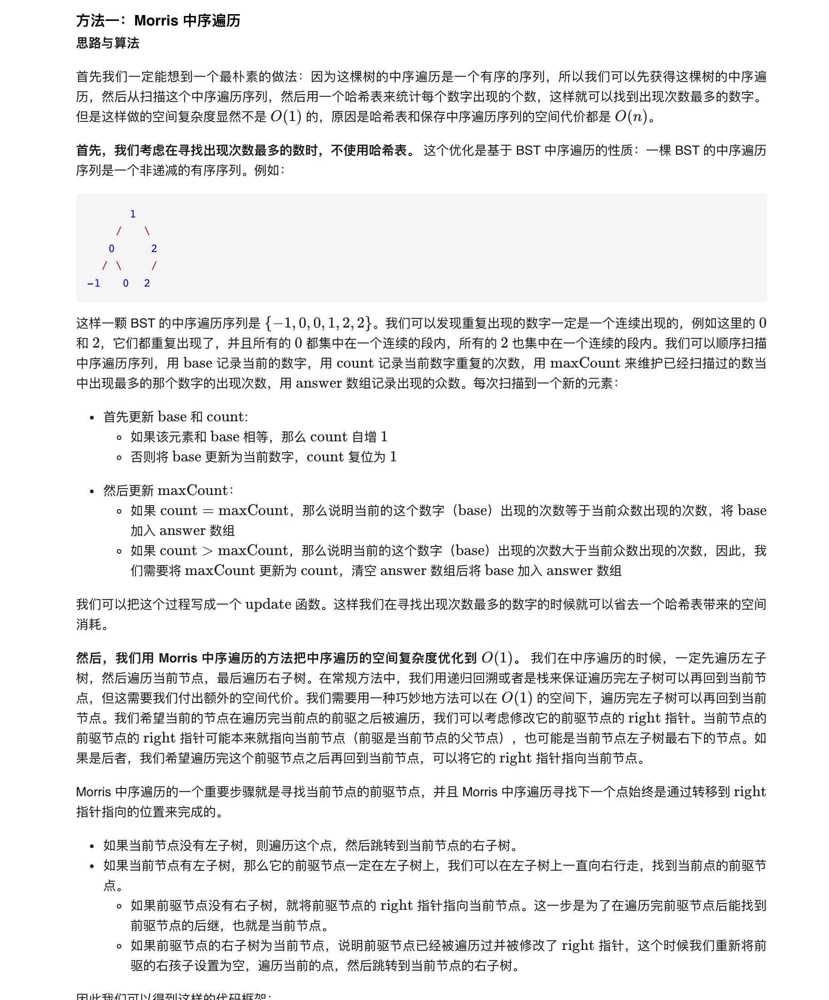

### 官方题解 [@link](https://leetcode-cn.com/problems/find-mode-in-binary-search-tree/solution/er-cha-sou-suo-shu-zhong-de-zhong-shu-by-leetcode-/)


```C++
TreeNode *cur = root, *pre = nullptr;
while (cur) {
    if (!cur->left) {
        // ...遍历 cur
        cur = cur->right;
        continue;
    }
    pre = cur->left;
    while (pre->right && pre->right != cur) {
        pre = pre->right;
    }
    if (!pre->right) {
        pre->right = cur;
        cur = cur->left;
    } else {
        pre->right = nullptr;
        // ...遍历 cur
        cur = cur->right;
    }
}
```

```Golang
func findMode(root *TreeNode) (answer []int) {
    var base, count, maxCount int
    update := func(x int) {
        if x == base {
            count++
        } else {
            base, count = x, 1
        }
        if count == maxCount {
            answer = append(answer, base)
        } else if count > maxCount {
            maxCount = count
            answer = []int{base}
        }
    }
    cur := root
    for cur != nil {
        if cur.Left == nil {
            update(cur.Val)
            cur = cur.Right
            continue
        }
        pre := cur.Left
        for pre.Right != nil && pre.Right != cur {
            pre = pre.Right
        }
        if pre.Right == nil {
            pre.Right = cur
            cur = cur.Left
        } else {
            pre.Right = nil
            update(cur.Val)
            cur = cur.Right
        }
    }
    return
}
```
