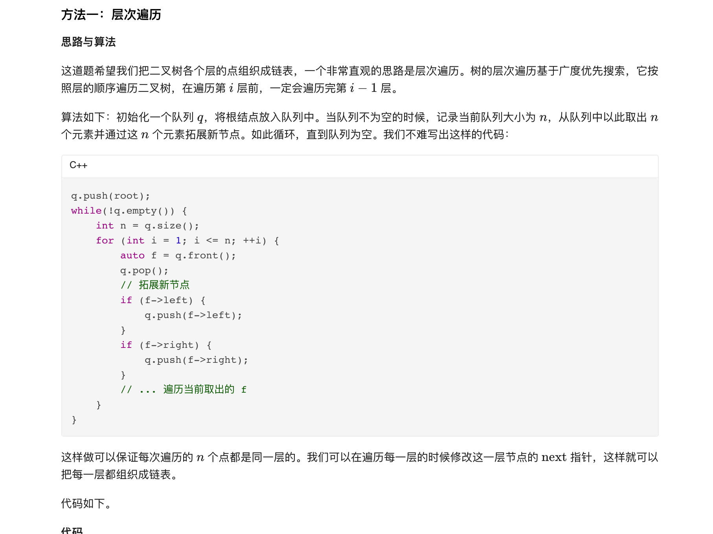
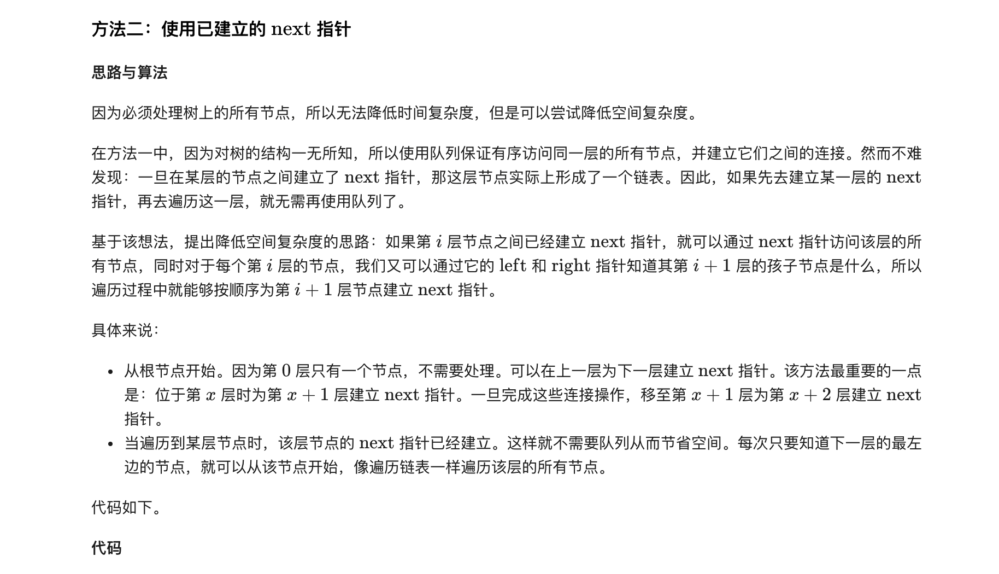

### 官方题解 [@link](https://leetcode-cn.com/problems/populating-next-right-pointers-in-each-node-ii/solution/tian-chong-mei-ge-jie-dian-de-xia-yi-ge-you-ce-15/)


```Golang
func connect(root *Node) *Node {
    if root == nil {
        return nil
    }
    q := []*Node{root}
    for len(q) > 0 {
        tmp := q
        q = nil
        for i, node := range tmp {
            if i+1 < len(tmp) {
                node.Next = tmp[i+1]
            }
            if node.Left != nil {
                q = append(q, node.Left)
            }
            if node.Right != nil {
                q = append(q, node.Right)
            }
        }
    }
    return root
}
```


```Golang
func connect(root *Node) *Node {
    start := root
    for start != nil {
        var nextStart, last *Node
        handle := func(cur *Node) {
            if cur == nil {
                return
            }
            if nextStart == nil {
                nextStart = cur
            }
            if last != nil {
                last.Next = cur
            }
            last = cur
        }
        for p := start; p != nil; p = p.Next {
            handle(p.Left)
            handle(p.Right)
        }
        start = nextStart
    }
    return root
}
```
