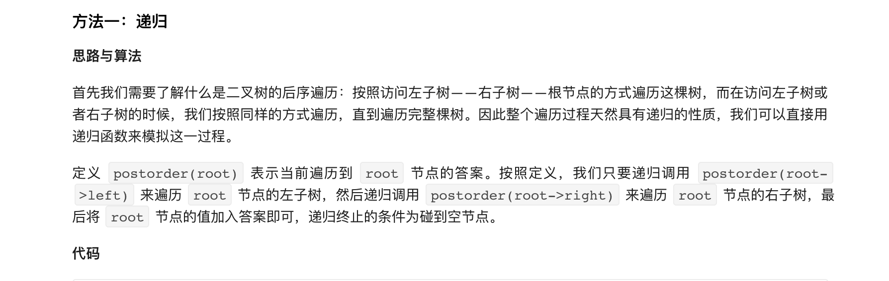

### 官方题解 [@link](https://leetcode-cn.com/problems/binary-tree-postorder-traversal/solution/er-cha-shu-de-hou-xu-bian-li-by-leetcode-solution/)


```Golang
func postorderTraversal(root *TreeNode) (res []int) {
    var postorder func(*TreeNode)
    postorder = func(node *TreeNode) {
        if node == nil {
            return
        }
        postorder(node.Left)
        postorder(node.Right)
        res = append(res, node.Val)
    }
    postorder(root)
    return
}
```


```Golang
func postorderTraversal(root *TreeNode) (res []int) {
    stk := []*TreeNode{}
    var prev *TreeNode
    for root != nil || len(stk) > 0 {
        for root != nil {
            stk = append(stk, root)
            root = root.Left
        }
        root = stk[len(stk)-1]
        stk = stk[:len(stk)-1]
        if root.Right == nil || root.Right == prev {
            res = append(res, root.Val)
            prev = root
            root = nil
        } else {
            stk = append(stk, root)
            root = root.Right
        }
    }
    return
}
```


```Golang
func postorderTraversal(root *TreeNode) (res []int) {
    addPath := func(node *TreeNode) {
        path := []int{}
        for ; node != nil; node = node.Right {
            path = append(path, node.Val)
        }
        for i := len(path) - 1; i >= 0; i-- {
            res = append(res, path[i])
        }
    }

    p1 := root
    for p1 != nil {
        if p2 := p1.Left; p2 != nil {
            for p2.Right != nil && p2.Right != p1 {
                p2 = p2.Right
            }
            if p2.Right == nil {
                p2.Right = p1
                p1 = p1.Left
                continue
            }
            p2.Right = nil
            addPath(p1.Left)
        }
        p1 = p1.Right
    }
    addPath(root)
    return
}
```
